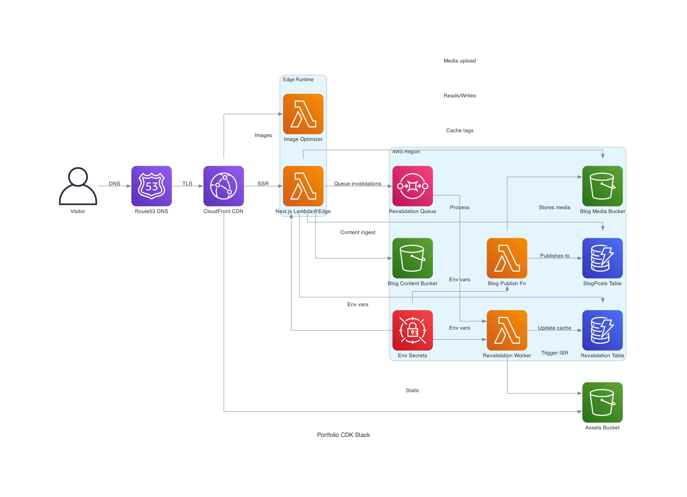

# Infrastructure Overview

## Stack Diagram

## Key Components

- **AWS CDK `PortfolioStack`** orchestrates all infrastructure, ingesting the OpenNext build output to wire CloudFront behaviors, origins, and Lambda bundles.
- **Amazon CloudFront** sits behind optional Route53 + ACM domains and powers all ingress. The default behavior runs the Next.js server Lambda@Edge; additional behaviors route static assets, image optimization, and other OpenNext origins.
- **S3 Buckets** include the versioned assets bucket (static + incremental cache) plus dedicated `BlogContent` and `BlogMedia` buckets for editor uploads and rendered markdown content.
- **DynamoDB** provides two tables: `BlogPosts` for CMS state (with a GSI on status/publishedAt) and `Revalidation` for Next.js tag cache metadata.
- **SQS + Lambda worker** processes incremental revalidation jobs emitted by the edge runtime, fanning out cache invalidations without blocking requests.
- **Blog publish Lambda & IAM scheduler role** let the admin UI publish/schedule posts while keeping AWS permissions scoped.
- **Secrets Manager integration** injects env vars into regional Lambdas and securely passes a curated subset to the edge runtime via CloudFront headers.

## Request Flow (High Level)

1. Requests resolve through Route53 (when configured) into CloudFront.
2. CloudFront either serves immutable static assets from the assets bucket or invokes the Lambda@Edge server for SSR and API routes.
3. The edge server reads runtime config from CloudFront origin headers, talks to DynamoDB for data and tag cache, and issues revalidation jobs onto SQS when paths need refreshing.
4. The regional revalidation worker dequeues jobs, updates the DynamoDB cache table, and triggers incremental static regeneration against the assets bucket.
5. Blog authoring flows run through regional Lambdas that read/write the BlogPosts table and upload content/media to their respective buckets while respecting Secrets Manager-sourced configuration.
