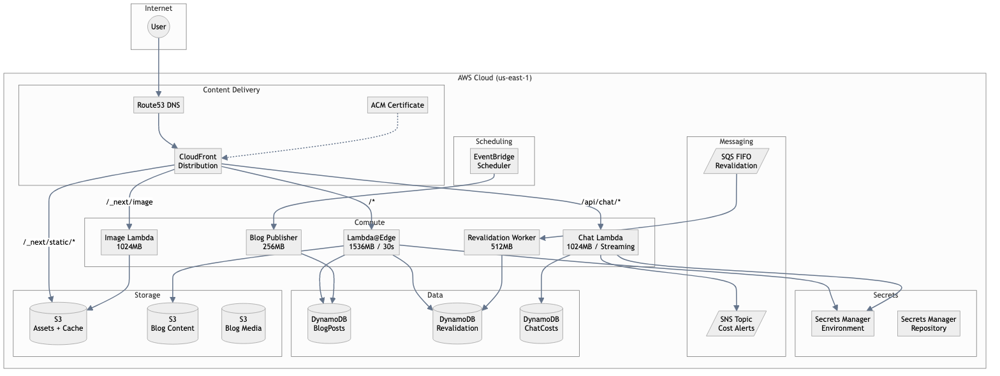

# Infrastructure

Detailed documentation of the AWS infrastructure managed by CDK.

## Overview

The infrastructure is defined in `infra/cdk/lib/portfolio-stack.ts` and deploys to AWS `us-east-1` (required for Lambda@Edge).



## Compute Resources

### Lambda@Edge (Server Function)

The main Next.js server runs at CloudFront edge locations:

| Property | Value |
|----------|-------|
| Runtime | Node.js 20.x |
| Memory | 1536 MB |
| Timeout | 30 seconds |
| Architecture | x86_64 |

Features:
- Runtime configuration via CloudFront origin headers
- Secrets injection from Secrets Manager
- ISR cache writes to S3/DynamoDB

### Chat Lambda (Regional)

Handles streaming chat responses:

| Property | Value |
|----------|-------|
| Runtime | Node.js 20.x |
| Memory | 1024 MB |
| Timeout | 30 seconds |
| Architecture | ARM64 |
| Invoke Mode | RESPONSE_STREAM |

Features:
- Function URL for streaming
- No IAM auth (public endpoint)
- Origin secret validation

### Image Optimization Lambda

Processes Next.js image optimization requests:

| Property | Value |
|----------|-------|
| Runtime | Node.js 20.x |
| Memory | 1024 MB |
| Timeout | 30 seconds |
| Architecture | ARM64 |

### Revalidation Worker

Processes ISR revalidation queue:

| Property | Value |
|----------|-------|
| Runtime | Node.js 20.x |
| Memory | 512 MB |
| Timeout | 30 seconds |
| Trigger | SQS event source |

## Storage

### Assets Bucket

Static assets and ISR cache:

| Property | Value |
|----------|-------|
| Encryption | S3-managed |
| Versioning | Enabled |
| Public Access | Blocked |
| Removal Policy | RETAIN |

Contents:
- `/_next/static/` - Built JavaScript/CSS
- `/_cache/` - ISR page cache

### Blog Content Bucket

Markdown blog post content:

| Property | Value |
|----------|-------|
| Encryption | S3-managed |
| Versioning | Enabled |
| Lifecycle | 90 days expiration |

### Blog Media Bucket

Images and attachments for blog posts:

| Property | Value |
|----------|-------|
| Encryption | S3-managed |
| Versioning | Enabled |
| CORS | Enabled for uploads |

## Database

### BlogPosts Table

| Attribute | Type | Description |
|-----------|------|-------------|
| `slug` (PK) | String | URL slug |
| `status` | String | draft/published/archived |
| `publishedAt` | String | ISO timestamp |

GSI: `byStatusPublishedAt` for listing published posts.

### Revalidation Table

| Attribute | Type | Description |
|-----------|------|-------------|
| `tag` (PK) | String | Cache tag |
| `path` (SK) | String | Page path |
| `revalidatedAt` | Number | Timestamp |

GSI: `revalidate` for path-based lookups.

### ChatRuntimeCost Table

| Attribute | Type | Description |
|-----------|------|-------------|
| `owner_env` (PK) | String | Owner/environment |
| `year_month` (SK) | String | YYYY-MM |

Tracks OpenAI API costs per month.

## Messaging

### Revalidation Queue (SQS FIFO)

Queues ISR revalidation requests:

| Property | Value |
|----------|-------|
| Type | FIFO |
| Visibility Timeout | 45 seconds |
| Dead Letter Queue | Yes (14 day retention) |
| Max Receive Count | 5 |

### Cost Alarm Topic (SNS)

Sends OpenAI cost alerts:

| Property | Value |
|----------|-------|
| Subscription | Email |
| Alarms | Rolling 30-day cost, missing metrics |

## CDN (CloudFront)

### Distribution Configuration

| Property | Value |
|----------|-------|
| HTTP Version | HTTP/2 and HTTP/3 |
| Price Class | PriceClass_200 |
| SSL | ACM certificate |

### Cache Behaviors

| Pattern | Origin | Cache Policy |
|---------|--------|--------------|
| `*` (default) | Lambda@Edge | Server (0s default TTL) |
| `/api/chat/*` | Chat Lambda | Server |
| `/_next/image` | Image Lambda | Image (30d default TTL) |
| `/_next/static/*` | S3 | Optimized (immutable) |

### Cache Policies

**Server Cache Policy:**
- Default TTL: 0 seconds
- Query strings: All
- Headers: accept, rsc, next-router-*, x-prerender-revalidate

**Image Cache Policy:**
- Default TTL: 30 days
- Query strings: All (url, w, q)
- Headers: accept

## DNS (Route53)

Creates A and AAAA records pointing to CloudFront:

- Primary domain (e.g., `example.com`)
- Alternate domains (e.g., `www.example.com`)

## Secrets

### Environment Secret

Contains per-environment secrets:

- `OPENAI_API_KEY`
- `REVALIDATE_SECRET`
- `NEXTAUTH_SECRET`
- `GH_CLIENT_SECRET`
- `GOOGLE_CLIENT_SECRET`

### Repository Secret

Contains repo-wide secrets:

- `GH_TOKEN`
- `ADMIN_EMAILS`

## Monitoring

### OpenAI Cost Alarm

Alerts when estimated 30-day cost exceeds $10:

```
Metric: PortfolioChat/OpenAI/EstimatedCost
Expression: SUM([cost], 30)
Threshold: >= 10
```

### Missing Metrics Alarm

Alerts when no cost data received for 3 days.

## IAM Permissions

### Lambda@Edge Role

- S3: Read/Write assets bucket
- DynamoDB: Read/Write all tables
- SQS: Send to revalidation queue
- Secrets Manager: Read secrets
- CloudFront: Create invalidations
- CloudWatch: Put metrics
- SES: Send email
- Scheduler: Create/Update/Delete schedules

### Chat Lambda Role

Same as Lambda@Edge plus SNS publish for alerts.

## Outputs

| Output | Description |
|--------|-------------|
| `DistributionDomainName` | CloudFront domain |
| `DistributionId` | CloudFront distribution ID |
| `AssetBucketName` | S3 assets bucket |
| `BlogPostsTableName` | DynamoDB posts table |
| `BlogContentBucketName` | S3 content bucket |
| `BlogMediaBucketName` | S3 media bucket |
