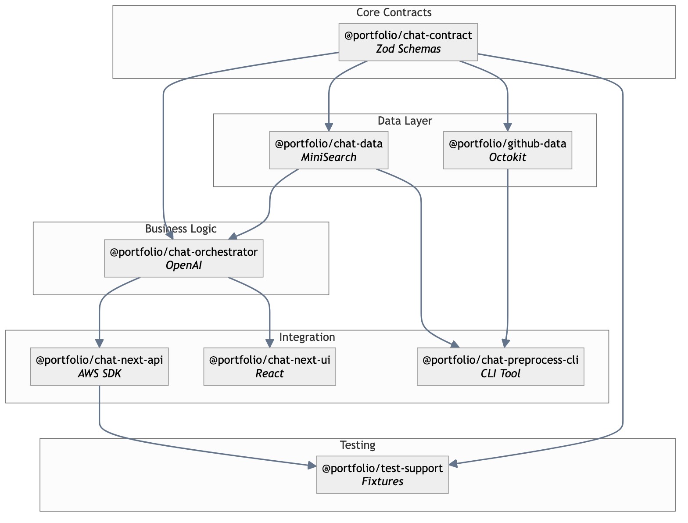

# Monorepo Packages

This document describes the package structure and dependencies in the monorepo.

## Package Overview

```
packages/
├── chat-contract/        # Shared type contracts
├── chat-data/           # Data layer with search
├── chat-orchestrator/   # OpenAI integration
├── chat-next-api/       # API route handlers
├── chat-next-ui/        # React UI components
├── chat-preprocess-cli/ # Preprocessing CLI
├── github-data/         # GitHub API client
└── test-support/        # Test utilities
```

## Dependency Graph



## Package Details

### @portfolio/chat-contract

**Purpose:** Shared TypeScript types and Zod schemas

**Key Exports:**
- `ChatRequestSchema` - Request validation
- `ChatResponseSchema` - Response types
- `DocumentSchema` - Indexed document types
- `ConfigSchema` - Configuration types

**Dependencies:** `zod`

---

### @portfolio/chat-data

**Purpose:** Document indexing and hybrid search

**Key Exports:**
- `createSearchIndex()` - Build MiniSearch index
- `search()` - Hybrid search (lexical + semantic)
- `scoreDocument()` - Relevance scoring

**Dependencies:** `minisearch`, `@portfolio/chat-contract`

---

### @portfolio/chat-orchestrator

**Purpose:** OpenAI integration and chat pipeline

**Key Exports:**
- `createChatOrchestrator()` - Main orchestrator
- `streamResponse()` - Streaming generation
- `countTokens()` - Token estimation

**Dependencies:** `openai`, `js-tiktoken`, `@portfolio/chat-contract`, `@portfolio/chat-data`

---

### @portfolio/chat-next-api

**Purpose:** Next.js API route handlers

**Key Exports:**
- `createChatHandler()` - Streaming chat endpoint
- `trackCost()` - Cost tracking
- `publishMetrics()` - CloudWatch integration

**Dependencies:** `@aws-sdk/client-*`, `@portfolio/chat-contract`, `@portfolio/chat-orchestrator`

**Peer Dependencies:** `next`, `openai`

---

### @portfolio/chat-next-ui

**Purpose:** React components and hooks

**Key Exports:**
- `useChat()` - Chat state management
- `ChatMessage` - Message component types
- `parseSSEStream()` - Stream parsing

**Dependencies:** `eventsource-parser`, `@portfolio/chat-contract`

**Peer Dependencies:** `react`, `react-dom`

---

### @portfolio/chat-preprocess-cli

**Purpose:** Generate embeddings from portfolio data

**Key Exports:**
- CLI binary at `./dist/index.js`

**Dependencies:** `@aws-sdk/client-s3`, `yaml`, `@portfolio/github-data`

**Peer Dependencies:** `@portfolio/chat-contract`, `@portfolio/chat-data`

---

### @portfolio/github-data

**Purpose:** GitHub API integration

**Key Exports:**
- `createGitHubClient()` - Octokit wrapper
- `fetchGistContent()` - Gist data fetching
- `fetchRepoFile()` - Repository file access

**Dependencies:** `@octokit/rest`, `@portfolio/chat-contract`

---

### @portfolio/test-support

**Purpose:** Test fixtures and mocks

**Key Exports:**
- `BLOG_TEST_FIXTURES` - Mock blog data
- `PORTFOLIO_TEST_FIXTURES` - Mock portfolio data
- `createMockBlogStore()` - In-memory blog store
- `createFixtureResponse()` - Mock chat responses

**Dependencies:** `@portfolio/chat-contract`, `@portfolio/chat-next-api`

**Import Restrictions:** ESLint enforces test-only imports

## Usage Patterns

### Source Imports

Most packages use TypeScript source directly:

```json
{
  "main": "./src/index.ts",
  "types": "./src/index.ts"
}
```

This allows:
- No build step for development
- Type checking across packages
- IDE navigation to source

### Workspace Protocol

Internal dependencies use pnpm workspace:

```json
{
  "dependencies": {
    "@portfolio/chat-contract": "workspace:*"
  }
}
```

### Peer Dependencies

Framework dependencies are peers:

```json
{
  "peerDependencies": {
    "next": "^14.0.0 || ^15.0.0",
    "react": "^18.0.0 || ^19.0.0"
  }
}
```

## Adding New Packages

1. Create package directory:
```bash
mkdir packages/my-package
```

2. Initialize `package.json`:
```json
{
  "name": "@portfolio/my-package",
  "version": "0.0.0",
  "private": true,
  "type": "module",
  "main": "./src/index.ts",
  "types": "./src/index.ts"
}
```

3. Add to workspace (automatic with `packages/*` glob)

4. Create source:
```bash
mkdir packages/my-package/src
touch packages/my-package/src/index.ts
```

5. Install dependencies:
```bash
pnpm install
```

## Build Considerations

Packages requiring compilation:

| Package | Reason | Command |
|---------|--------|---------|
| `chat-preprocess-cli` | CLI binary | `pnpm build` |
| `@portfolio/cdk` | CDK app | `pnpm build` |

Production bundles (via Next.js):
- All packages are bundled into Lambda functions
- Tree-shaking removes unused exports
- Output tracing includes necessary files
