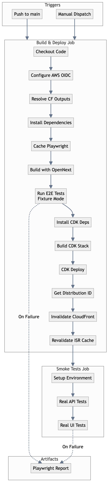

# CI/CD Pipeline

The portfolio uses GitHub Actions for continuous integration and deployment.

## Workflows

### Deploy Workflow

**File:** `.github/workflows/deploy.yml`

**Triggers:**
- Push to `main` branch
- Manual workflow dispatch

**Jobs:**

1. **Build & Deploy**
   - Install dependencies
   - Build Next.js with OpenNext
   - Run E2E tests (fixture mode)
   - Build CDK
   - Deploy to AWS
   - Invalidate CloudFront cache
   - Revalidate ISR caches

2. **Smoke Tests**
   - Run real API tests against deployed app
   - Run real UI tests against deployed app

### Test Workflow

**File:** `.github/workflows/test.yml`

**Triggers:**
- Pull requests to `main`

**Jobs:**
- Build Next.js
- Run Playwright E2E tests
- Upload test report artifacts

## Pipeline Stages



## Skip Tests Mode

Add `[skip]` to commit message to skip tests:

```bash
git commit -m "Quick fix [skip]"
```

Or use workflow dispatch with `skip_tests: true`.

## AWS Authentication

Uses OIDC (OpenID Connect) for secure, keyless authentication:

```yaml
- name: Configure AWS credentials (OIDC)
  uses: aws-actions/configure-aws-credentials@v4
  with:
    role-to-assume: ${{ vars.CDK_DEPLOY_ROLE_ARN }}
    aws-region: us-east-1
```

### Required IAM Permissions

The deploy role needs:
- CloudFormation full access
- Lambda full access
- S3 full access
- DynamoDB full access
- CloudFront full access
- Route53 (if using custom domain)
- ACM (if using custom domain)
- Secrets Manager read
- IAM role management (for Lambda execution roles)

## Environment Variables

### From Vars (Non-sensitive)

```yaml
env:
  AWS_REGION: ${{ vars.AWS_REGION }}
  APP_DOMAIN_NAME: ${{ vars.APP_DOMAIN_NAME }}
  PORTFOLIO_GIST_ID: ${{ vars.PORTFOLIO_GIST_ID }}
```

### From Secrets

```yaml
env:
  GH_TOKEN: ${{ secrets.GH_TOKEN }}
  REVALIDATE_SECRET: ${{ secrets.REVALIDATE_SECRET }}
  NEXTAUTH_SECRET: ${{ secrets.NEXTAUTH_SECRET }}
```

## Caching

### pnpm Cache

```yaml
- uses: actions/setup-node@v4
  with:
    cache: 'pnpm'
```

### Playwright Cache

```yaml
- uses: actions/cache@v4
  with:
    path: ~/.cache/ms-playwright
    key: playwright-chromium-${{ runner.os }}-${{ hashFiles('**/pnpm-lock.yaml') }}
```

## Artifacts

Test reports uploaded on failure:

```yaml
- name: Upload test results
  if: failure()
  uses: actions/upload-artifact@v4
  with:
    name: playwright-report
    path: playwright-report/
    retention-days: 30
```

## Cache Invalidation

Post-deploy cache invalidation:

```yaml
- name: Invalidate CloudFront cache
  run: |
    aws cloudfront create-invalidation \
      --distribution-id ${{ steps.get-distribution.outputs.distribution_id }} \
      --paths "/blog" "/blog/*" "/projects" "/projects/*" "/api/*"
```

## Revalidation

ISR cache revalidation via API:

```yaml
- name: Revalidate server caches
  run: |
    curl -X POST "${TARGET_URL}/api/revalidate" \
      -H "x-revalidate-secret: ${REVALIDATE_SECRET}" \
      -d '{"paths":["/projects","/blog"],"tags":["github-repos","posts"]}'
```

## Concurrency

Prevents overlapping deployments:

```yaml
concurrency:
  group: deploy-${{ github.ref }}
  cancel-in-progress: true
```

## Troubleshooting

### Build Failures

1. Check OpenNext build output
2. Verify all environment variables set
3. Check for TypeScript errors

### Test Failures

1. Review Playwright report artifact
2. Check if fixtures are properly loaded
3. Verify test environment configuration

### Deploy Failures

1. Check CloudFormation events in AWS console
2. Review CDK diff output
3. Verify IAM permissions

### Smoke Test Failures

1. Confirm deployment completed
2. Check CloudFront distribution is enabled
3. Verify DNS propagation (custom domain)
