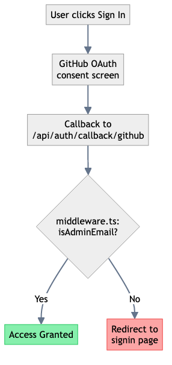

# Admin UI Documentation

## Overview

The admin UI provides a comprehensive blog content management system accessible at `/admin`. It follows the design specifications from `blog.md` and implements a clean, keyboard-friendly interface for managing blog posts.

## Features

### Posts List (`/admin`)

- **Search**: Filter posts by title or slug
- **Status Filter**: Filter by draft, scheduled, published, or archived status
- **Table View**: Displays title, status, updated date, published date, and actions
- **Quick Actions**: Edit, View, Publish, Archive, and Delete buttons for each post

### Post Editor (`/admin/[slug]` and `/admin/new`)

- **Metadata Form**:
  - Title (required)
  - Slug (auto-generated from title, required)
  - Summary (required)
  - Tags (comma-separated)
  - Hero Image Key
- **Markdown Editor**:
  - Syntax highlighting toolbar
  - Preview mode
  - Common markdown shortcuts (bold, italic, code, links, images, headings, lists)
- **Media Uploader**:
  - Drag-and-drop support
  - File validation (JPEG, PNG, GIF, WebP, max 5MB)
  - Presigned S3 upload
  - Easy insertion into content
- **Actions Sidebar**:
  - Save Draft
  - Preview Draft (opens in new tab)
  - Publish Now
  - View Live (for published posts)
- **Post Info**: Version, created date, published date

### Keyboard Shortcuts

- `⌘ + S` - Save Draft (planned)
- `⌘ + P` - Preview (planned)

## File Structure

```
src/app/admin/
├── page.tsx                           # Posts list page
├── [slug]/page.tsx                    # Edit post page
├── new/page.tsx                       # New post page
├── layout.tsx                         # Admin layout with navigation
├── not-found.tsx                      # 404 page
└── components/
    ├── PostsFilters.tsx              # Search and status filters
    ├── PostsTable.tsx                # Posts table with actions
    ├── PostEditor.tsx                # Main post editor component
    ├── MarkdownEditor.tsx            # Markdown editor with toolbar
    └── MediaUploader.tsx             # Media upload component
```

## API Endpoints Required

The UI expects the following API endpoints to be implemented:

### Posts Management

- `GET /api/admin/posts` - List posts (with optional ?status and ?search params)
- `GET /api/admin/posts/[slug]` - Get single post with content
- `POST /api/admin/posts` - Create new post
- `PUT /api/admin/posts/[slug]` - Update post
- `POST /api/admin/posts/[slug]/publish` - Publish post
- `POST /api/admin/posts/[slug]/archive` - Archive post
- `POST /api/admin/posts/[slug]/delete` - Delete post

### Media Management

- `POST /api/admin/media/presigned-url` - Get presigned S3 upload URL

### Preview

- `GET /api/draft` - Enable draft mode and redirect

## Authentication

The admin routes are protected by Auth.js middleware (configured in `middleware.ts`). Users must:

1. Be authenticated via OAuth (Google/GitHub)
2. Have their email in the `ADMIN_EMAILS` environment variable

### Authentication Flow Diagram



## Accessibility

- High contrast UI using design system tokens
- Visible focus states on all interactive elements
- ARIA labels and roles for screen readers
- ARIA-live regions for status messages
- Keyboard navigation support

## Styling

Uses the existing Tailwind CSS design system with custom UI components:

- Button variants (default, outline, ghost, destructive, secondary)
- Card components for content sections
- Input and Textarea with consistent styling
- Status badges with color coding

## Next Steps

To make the admin UI fully functional, you'll need to:

1. **Implement Backend APIs**: Create the API routes listed above in `src/app/api/admin/`
2. **Set up DynamoDB and S3**: Configure the infrastructure as specified in `blog.md`
3. **Configure Auth.js**: Set up OAuth providers and middleware (may already be done)
4. **Add Keyboard Shortcuts**: Implement the keyboard event handlers
5. **Enhance Preview**: Wire up the actual markdown renderer for the preview mode
6. **Add Scheduling**: Implement the scheduling UI and EventBridge integration
7. **Add Rich Editor**: Consider adding a rich text editor option alongside markdown

## Environment Variables

Required environment variables:

- `ADMIN_EMAILS` - Comma-separated list of allowed admin emails
- `NEXTAUTH_SECRET` - Auth.js secret
- `NEXTAUTH_URL` - Auth.js callback URL
- `GOOGLE_CLIENT_ID` / `GOOGLE_CLIENT_SECRET` - OAuth credentials
- `POSTS_TABLE` - DynamoDB table name
- `CONTENT_BUCKET` - S3 bucket for content
- `MEDIA_BUCKET` - S3 bucket for media
- `CLOUDFRONT_DISTRIBUTION_ID` - For cache invalidation
