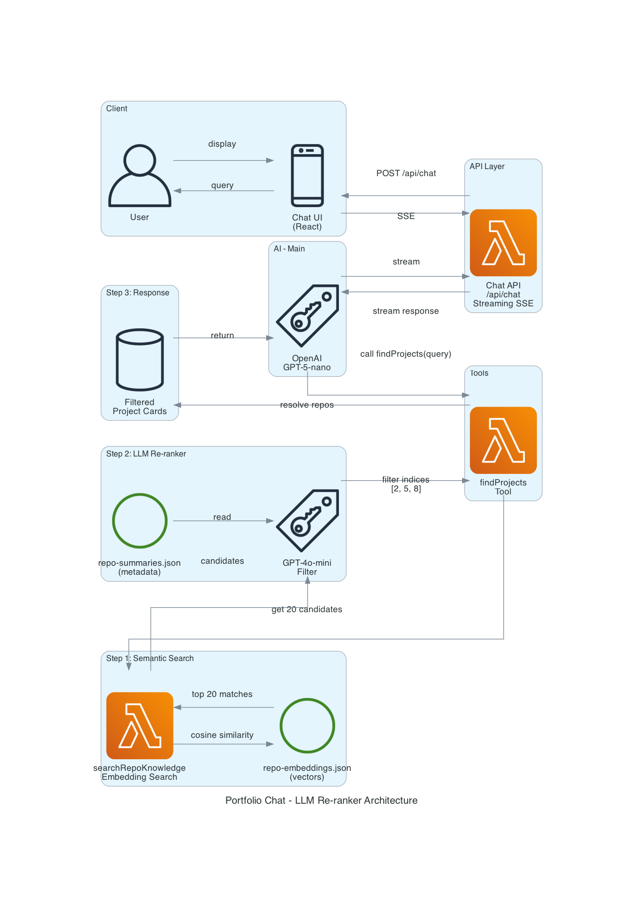

# Portfolio Chat Feature

> **Last Updated:** November 2025  
> **Architecture:** Simplified single-tool semantic search



## Overview

The portfolio chatbot helps users discover projects through natural language queries. It uses a single semantic search tool powered by OpenAI embeddings to match user intent with relevant project cards.

## Architecture

### Flow

1. **User Query** → Chat UI (React component)
2. **Chat UI** → POST to `/api/chat` (Server-Sent Events streaming)
3. **Chat API** → OpenAI GPT-5-nano with system prompt + tools
4. **LLM** → Calls `findProjects(query)` tool with natural language
5. **findProjects** → Semantic search over precomputed embeddings
6. **LLM Re-ranker** → GPT-4o-mini filters candidate list for true matches
7. **LLM** → Narrates the lookup once, references the returned project cards directly
8. **API** → Streams back to client via SSE
9. **Chat UI** → Renders project cards + message

### Key Components

#### Chat API (`src/app/api/chat/route.ts`)

- Handles streaming responses using Server-Sent Events (SSE)
- Enforces rate limiting (prevents abuse)
- Manages OpenAI client lifecycle
- Routes tool calls to appropriate handlers

#### System Prompt (`src/server/prompt/buildSystemPrompt.ts`)

- Defines chatbot personality and voice (first person, conversational)
- Provides project inventory overview and a deduped list of allowed languages/topics
- Sets boundaries (no repo creation, no false claims, no placeholder text)
- Instructs tool usage patterns (narrate tool calls once, avoid redundant summaries, never promise capabilities outside the portfolio)

#### Single Tool: `findProjects`

- **Purpose:** Search for projects using natural language
- **Input:** `{ query: string, limit: number }`
- **Output:** Array of matching project cards
- **Method:** Semantic similarity via embeddings

#### Search Engine with LLM Re-ranker (`src/server/tools/github-tools.ts`)

````typescript
async function findProjects({ query, limit = 5 }) {
  // Step 1: Semantic search returns broader candidates (4x limit, max 20)
  const candidates = await searchRepoKnowledge(query, limit * 4);

  // Step 2: Prepare candidate summaries for LLM
  const candidateList = candidates.map(
    (c, i) => `${i}. ${c.name}: ${c.summary} | Languages: ${c.languages} | Tags: ${c.tags}`
  );

  // Step 3: Ask LLM to filter and rank (GPT-4o-mini)
  const response = await llm.chat({
    system: 'You are a project filter. Return indices of projects that match the query. Filter false positives.',
    user: `Query: "${query}"\n\nCandidates:\n${candidateList}\n\nReturn JSON array of matching indices:`,
  });

  // Guard against fenced JSON responses
  const cleaned = response
    .replace(/```json/gi, '')
    .replace(/```/g, '')
    .trim();

  const filteredIndices = JSON.parse(cleaned || '[]'); // e.g., [2, 5, 8]

  // Step 4: Return filtered projects
  return filteredIndices.slice(0, limit).map((idx) => candidates[idx]);
}
````

If the re-ranker returns malformed data we log it and fall back to the semantic ranking so the chat still answers (and the logs capture the issue).

## Data Pipeline

### Build-Time Generation

**Script:** `scripts/generate-project-knowledge.ts`

For each repository:

1. Fetch README (truncated to 8K chars)
2. Call GPT-5-nano twice:
   - **Pass 1:** Extract facts (languages, frameworks, domains)
   - **Pass 2:** Generate 2-sentence summary + tags
3. Embed summary + tags + facts → vector
4. Save to `generated/repo-summaries.json` and `generated/repo-embeddings.json`

### Runtime Data

- **repo-summaries.json:** Metadata (name, summary, tags, languages)
- **repo-embeddings.json:** Precomputed vectors for each repo
- Both files are committed and deployed with the app

## Tool Definition

```typescript
{
  type: 'function',
  name: 'findProjects',
  description: 'Search for projects in the portfolio using natural language (e.g., "TypeScript projects using AWS", "web scraping tools", "iOS apps"). Returns matching project cards. If no matches found, returns empty array.',
  parameters: {
    query: {
      type: 'string',
      description: 'Natural language search query'
    },
    limit: {
      type: 'number',
      description: 'Maximum results (default: 5)',
      default: 5
    }
  }
}
```

## Key Features

### ✅ What Works Well

- **Natural Language:** Users can ask "show me your TypeScript work" or "AWS CDK projects"
- **Hybrid Intelligence:** Semantic search (embeddings) + LLM re-ranker (GPT-4o-mini)
- **False Positive Filtering:** LLM intelligently filters bad matches (e.g., "Rust" won't match "Rubiks")
- **Efficient:** Single embedding call, fast LLM filtering (< 100 tokens)
- **Streaming:** Results appear progressively via SSE
- **Project Cards:** Rich UI components with metadata, languages, tags
- **Transparent Tooling:** Assistant narrates the lookup once, then references projects by name (no "check the cards" placeholders)
- **Graceful Failures:** Empty results handled naturally ("I don't have Rust projects yet")
- **Conversational UX:** Brief intro before tool calls, no redundant details after cards

### 🎯 Design Principles

1. **Hybrid Retrieval:** Embeddings for broad matching, LLM for intelligent filtering
2. **Keep It Simple:** One tool, minimal layers, graceful fallbacks
3. **Trust AI Intelligence:** Let models do what they're good at (understanding relevance)
4. **Conversational:** Responds in first person, relaxed tone, brief intros
5. **Card-First:** Always attach project cards, never repeat details in text

## Response Patterns

### Successful Match

```
User: "Show me your Next.js projects"
Bot: "Let me check my Next.js work..." [Calls findProjects("Next.js")] → [Attaches cards] → "Built several production apps with it."
```

### No Match (LLM Filter Prevents False Positives)

```
User: "Do you have Rust projects?"
Bot: "Checking for Rust work..."
  → [Semantic search finds "Rubiks" as similar]
  → [LLM re-ranker: "Rubiks is not Rust, return []"]
  → [Empty result]
  → "I don't have Rust projects yet. I work primarily with TypeScript, Go, and Python. Want to see those?"
```

### Clarification Needed

```
User: "Show me your work"
Bot: "Here are some highlights:" [Calls findProjects("featured projects", limit: 5)] → [Attaches starred repos]
```

## Configuration

### Environment Variables

- `OPENAI_API_KEY` - Required for embeddings + chat
- `CHAT_ANALYZER_LOGGING` - Enable query logging (default: on)
- `CHAT_TOOL_LOGGING` - Enable tool call logging (default: on)

### Rate Limiting

- **Endpoint:** `/api/chat`
- **Limit:** Configured via `enforceChatRateLimit()`
- **Response:** 429 with `Retry-After` header

## Caching Strategy

### Server-Side

- GitHub API calls cached with `unstable_cache` (1 hour TTL)
- Repo data shared across SSR routes and API endpoints
- Tagged for manual invalidation via `/api/revalidate`

### Client-Side

- React Query manages chat UI cache (5 min stale time)
- Project cards cached per session
- No pre-hydration from SSR (chat loads lazily)
- Cards rendered in the UI are interactive—you can click through to full READMEs or docs without the assistant repeating that information.

## Telemetry & Logging

- `findProjects` logs now include:
  - `candidates`: array of repo names produced by semantic search
  - `filteredCandidates`: array of repo names kept after the LLM re-ranker
  - `resultCandidates`: array of repo names actually returned (after limit/dup filtering)
  - `fallbackReason`: present when the re-ranker fails and we fall back to raw semantic ordering
- Zero-result logs (`findProjects.zeroResults`) also list the candidate names and fallback reason.
- These logs show up in the server console (e.g., `@node` snippets) for quick debugging.

## Testing

### Key Test Cases

1. **Semantic search works:** "AI projects" returns AI-tagged repos
2. **Empty results handled:** "Rust projects" → graceful message
3. **Language matching:** "typescript", "TypeScript", "TS" all work
4. **Topic matching:** "AWS", "serverless", "CDK" surface correct projects
5. **Limit enforcement:** `limit: 1` returns single project
6. **Starred boost:** Featured repos appear first when relevant

### Integration Tests

Location: `src/app/api/chat/route.test.ts`

- Test mode header returns deterministic fixtures
- Rate limiting enforced correctly
- SSE streaming format validated

## Performance

- **Query Embedding:** ~200ms (OpenAI text-embedding-3-small)
- **Similarity Computation:** <5ms (in-memory cosine similarity)
- **LLM Re-ranking:** ~300-500ms (GPT-4o-mini, ~100 tokens)
- **Total Response:** ~600-800ms for first token
- **Cost per Query:** ~$0.0001 (embedding + mini re-rank)
- **Embeddings Size:** ~1KB per repo (1536 dimensions)
- **Total Data:** ~10-50KB for typical portfolio

## Why LLM Re-ranker?

This hybrid approach combines the best of both worlds:

**Pure Semantic Search (embeddings only):**

- ❌ False positives: "Rust" matches "Rubiks" due to string similarity
- ❌ No understanding of context or technology differences
- ✅ Fast and cheap
- ✅ Finds semantically similar content

**LLM in Context (no tools):**

- ❌ Doesn't scale beyond ~50 repos (token limits)
- ❌ Higher cost per query
- ✅ Perfect accuracy
- ✅ No false positives

**Hybrid (Semantic + LLM Re-ranker):**

- ✅ Scales to hundreds of repos
- ✅ Filters false positives intelligently
- ✅ Fast: 1 embedding + 1 mini-LLM call
- ✅ Cheap: ~$0.0001 per query
- ✅ Graceful fallback if LLM fails

## Future Enhancements

- [ ] Conversation memory (multi-turn context)
- [ ] Follow-up questions ("tell me more about X")
- [ ] README deep-dive tool (load full docs on demand)
- [ ] Usage analytics (popular queries, zero-result patterns)
- [ ] A/B test different re-ranking prompts

## Troubleshooting

### LLM doesn't call tool

- Check system prompt includes tool usage instructions
- Verify tool definition is valid JSON schema
- Ensure model supports function calling (gpt-5-nano does)

### Poor search results

- Regenerate embeddings: `npm run generate:knowledge`
- Check repo summaries quality (Pass 2 in generation)
- Adjust similarity threshold if needed

### Rate limit hit

- Increase limit in `enforceChatRateLimit()` config
- Add user authentication for higher limits
- Cache common queries

## Related Files

- `src/app/api/chat/route.ts` - Main API handler
- `src/server/project-knowledge.ts` - Search logic
- `src/server/prompt/buildSystemPrompt.ts` - LLM instructions
- `src/server/tools/index.ts` - Tool definitions
- `scripts/generate-project-knowledge.ts` - Build pipeline
- `generated/repo-summaries.json` - Metadata
- `generated/repo-embeddings.json` - Vectors

---

**Questions?** This doc replaces all previous chat architecture documentation.
