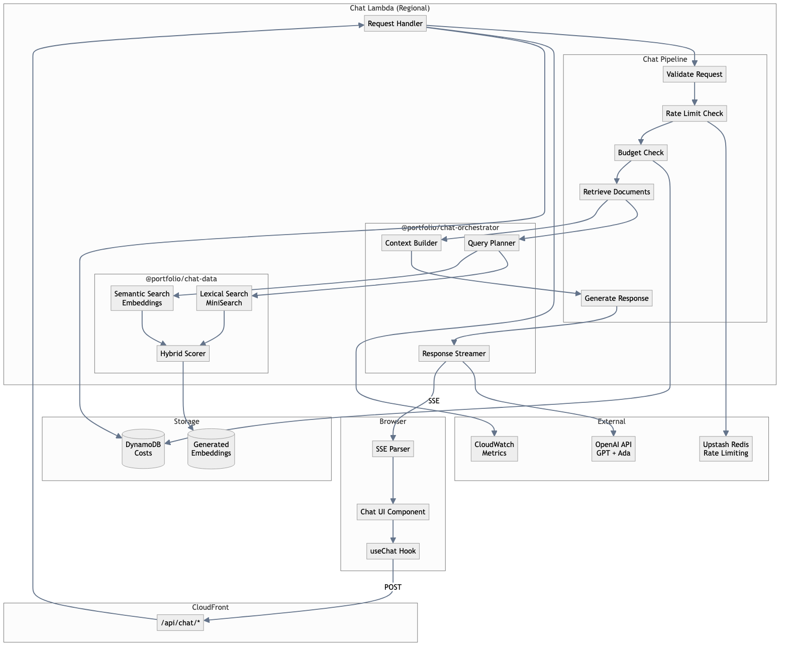

# Chat Architecture

Technical deep-dive into the chat system architecture.

## System Diagram



## Package Responsibilities

### @portfolio/chat-contract

Defines shared types with Zod:

```typescript
// Request schema
const ChatRequestSchema = z.object({
  message: z.string().min(1).max(2000),
  conversationId: z.string().optional(),
});

// Document schema
const DocumentSchema = z.object({
  id: z.string(),
  content: z.string(),
  metadata: z.object({
    source: z.string(),
    timestamp: z.string().optional(),
  }),
  embedding: z.array(z.number()).optional(),
});
```

### @portfolio/chat-data

Implements hybrid search:

```typescript
// Create search index
const index = createSearchIndex(documents, {
  fields: ['content', 'title'],
  storeFields: ['content', 'metadata'],
});

// Hybrid search combining lexical + semantic
const results = search(index, {
  query: userMessage,
  embedding: queryEmbedding,
  topK: 8,
  weights: {
    textWeight: 0.3,
    semanticWeight: 0.5,
    recencyLambda: 0.05,
  },
});
```

### @portfolio/chat-orchestrator

Manages the LLM pipeline:

```typescript
// Create orchestrator
const orchestrator = createOrchestrator({
  openai: openaiClient,
  config: chatConfig,
  documents: loadedDocuments,
});

// Stream response
async function* chat(message: string, context: Context) {
  // Plan retrieval
  const retrievalPlan = await planQuery(message);

  // Retrieve documents
  const docs = await retrieveDocuments(retrievalPlan);

  // Build prompt
  const prompt = buildPrompt(message, docs, persona);

  // Stream response
  for await (const chunk of streamCompletion(prompt)) {
    yield chunk;
  }
}
```

### @portfolio/chat-next-api

Handles HTTP layer:

```typescript
export async function POST(request: NextRequest) {
  // Validate request
  const body = await request.json();
  const { message } = ChatRequestSchema.parse(body);

  // Check rate limit
  await checkRateLimit(request);

  // Check budget
  await checkBudget();

  // Stream response
  const stream = createStreamingResponse(
    orchestrator.chat(message)
  );

  // Track cost after completion
  trackCost(stream.usage);

  return new Response(stream);
}
```

### @portfolio/chat-next-ui

React integration:

```typescript
export function useChat() {
  const [messages, setMessages] = useState([]);
  const [isStreaming, setIsStreaming] = useState(false);

  const sendMessage = async (message: string) => {
    setIsStreaming(true);

    const response = await fetch('/api/chat', {
      method: 'POST',
      body: JSON.stringify({ message }),
    });

    const reader = response.body.getReader();
    const parser = createEventStreamParser();

    for await (const event of parseStream(reader, parser)) {
      if (event.type === 'chunk') {
        appendToMessage(event.content);
      }
    }

    setIsStreaming(false);
  };

  return { messages, sendMessage, isStreaming };
}
```

## Retrieval Strategy

### Document Sources

| Source | Content | Update Frequency |
|--------|---------|------------------|
| Profile | Bio, skills | Build time |
| Resume | Work experience | Build time |
| Projects | Project descriptions | Build time |
| Persona | AI personality | Build time |

### Scoring Algorithm

Documents are scored using weighted combination:

```
score = (textWeight × lexicalScore)
      + (semanticWeight × semanticScore)
      × exp(-recencyLambda × ageInDays)
```

### Relevance Filtering

Documents below `minRelevanceScore` threshold are excluded:

```yaml
retrieval:
  minRelevanceScore: 0.3  # 30% of top match
```

## Streaming Architecture

### Lambda Function URL

Chat uses Lambda Function URL with response streaming:

```typescript
// open-next.config.ts
functions: {
  chat: {
    patterns: ['/api/chat', '/api/chat/*'],
    override: {
      wrapper: 'aws-lambda-streaming',
    },
  },
}
```

### SSE Format

Server-Sent Events with JSON payloads:

```
data: {"type":"chunk","content":"Hello"}
data: {"type":"chunk","content":" world"}
data: {"type":"done","usage":{"prompt":100,"completion":50}}
```

## Cost Management

### Budget Enforcement

```typescript
async function checkBudget(): Promise<boolean> {
  const monthlySpend = await getMonthlySpend();
  const budget = config.cost.budgetUsd;

  if (monthlySpend >= budget) {
    throw new BudgetExceededError();
  }

  return true;
}
```

### Cost Tracking

Costs tracked in DynamoDB:

| Column | Description |
|--------|-------------|
| `owner_env` | Owner/environment |
| `year_month` | YYYY-MM |
| `total_cost` | Running total |
| `request_count` | Number of requests |

### CloudWatch Metrics

Published after each request:

```typescript
await cloudwatch.putMetricData({
  Namespace: 'PortfolioChat/OpenAI',
  MetricData: [{
    MetricName: 'EstimatedCost',
    Value: requestCost,
    Unit: 'None',
  }],
});
```

## Error Handling

### Validation Errors

Return 400 with error details:

```json
{
  "error": "validation_error",
  "message": "Message too long",
  "field": "message"
}
```

### Rate Limiting

Return 429 with retry information:

```json
{
  "error": "rate_limited",
  "retryAfter": 60
}
```

### Budget Exceeded

Return 503 with explanation:

```json
{
  "error": "budget_exceeded",
  "message": "Monthly chat budget reached"
}
```
