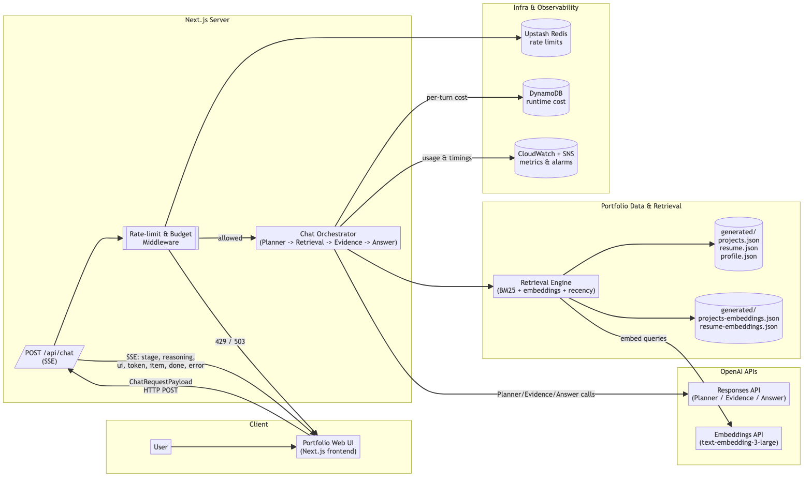
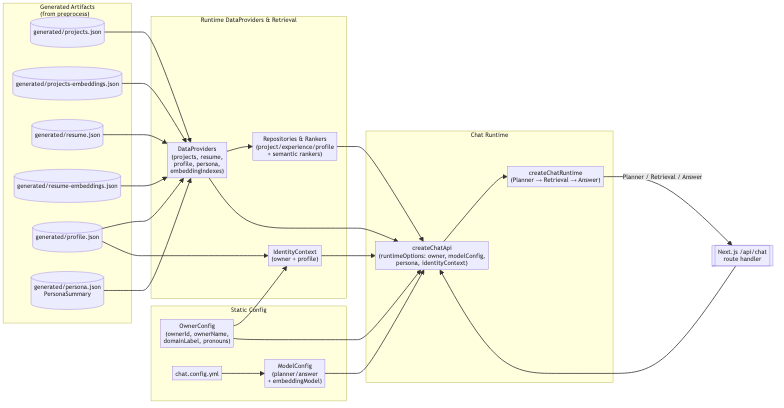
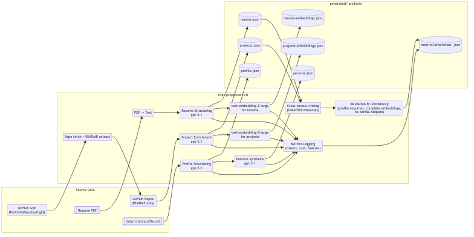
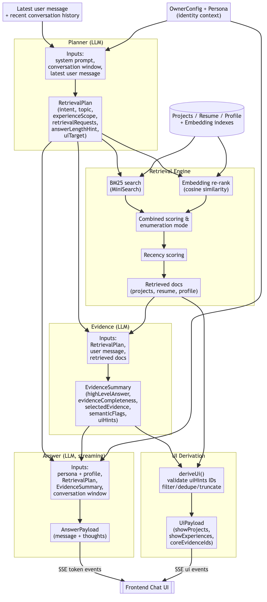
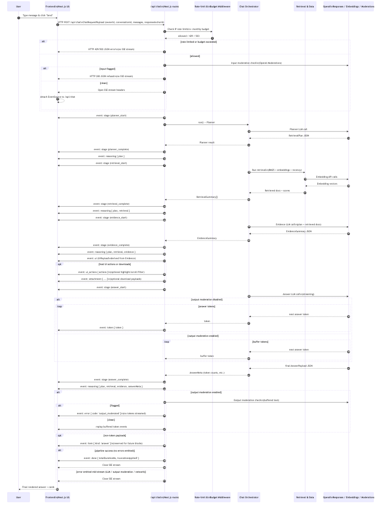
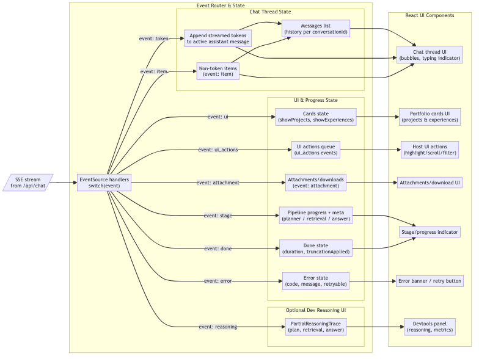

# Portfolio Chat Engine — Architecture & Design Spec (vNext · 2025‑11‑23)

Single‑owner “talk to my portfolio” engine (reconfigurable per deployment), built as a staged RAG pipeline with explicit question typing and evidence‑driven UI.

---

## 0. Summary

Portfolio Chat Engine is a domain‑agnostic, persona‑shaped RAG system that lets users chat with a portfolio owner (“I”) about their work: projects, experience, skills, and background.

The engine is parameterized by an OwnerConfig, so the same code can power:

- A software engineer’s personal site.
- A freelance designer’s portfolio.
- A research group’s publication showcase.
- A team / organization profile.

At a high level:

- **Inputs**
  - User messages (chat history).
  - OwnerConfig (who this "I" is, and in what domain).
  - Preprocessed portfolio data:
    - Projects, resume‑like experiences, profile text, persona summary.
    - Embedding indexes for semantic retrieval.
- **Pipeline**
  - Planner → Retrieval → Evidence → Answer.
  - All stages use the OpenAI Responses API with structured JSON output.
  - Planner sets questionType, enumeration, scope, and whether cards are enabled.
- **Outputs**
  - Streamed answer text in first person ("I…").
  - Evidence‑aligned UI hints:
    - Project / experience IDs chosen by the Evidence stage via uiHints.
    - Optional per‑turn reasoning trace (plan, retrieval, evidence, answer metadata), streamed only when requested per run.

**Design goals**

- Grounded – Only asserts facts present in the owner's portfolio data.
- Evidence‑aligned UI – Cards and lists shown to the user come from the Evidence stage, not raw retrieval.
- Question‑aware – Planner distinguishes binary vs lists vs narratives vs meta and encodes completeness/scope expectations.
- Observable – Every turn has a structured reasoning trace and token metrics.
- Composable – Orchestrator and UI are decoupled via a clean SSE contract.
- Reusable – Driven by OwnerConfig and data providers; domain-agnostic.
- Cheap & fast – Uses nano-class runtime models (e.g., gpt‑5‑nano‑2025‑08‑07); offline preprocessing uses full-size models (e.g., gpt‑5.1‑2025‑11‑13).
- Measurable – Preprocessing and runtime both emit token and cost metrics.

Companion docs:

- Runtime cookbook and guardrails: `docs/features/chat/implementation-notes.md`.
- Chat evals: `docs/features/chat/evals-and-goldens.md`.

---

## 1. Goals & Requirements

### 1.1 Product Goals

For a given owner (person / team / org), users should be able to:

- Chat with the portfolio owner as if they were present, in a consistent "I" voice.
- Ask questions about:
  - Projects – what, why, how, tech, impact.
  - Experience – jobs, internships, education, other roles.
  - Skills – tools, languages, frameworks, domains.
  - High‑level "about you" – background, focus areas, location, domain label.
- Get answers that are:
  - Grounded in actual portfolio data.
  - Stylistically aligned with the owner's persona.
  - UI‑consistent with the text answer:
    - Cards shown must be relevant to the answer (e.g. only Go‑using work when answering "Have you used Go?").
- Have light meta / chit‑chat ("hi", "thanks", "how do you work?") without the bot degenerating into a generic assistant.
- Ask:
  - Binary fact‑check questions ("Have you used Go?").
  - List / enumeration questions ("Which projects have you used Go on?").
  - Narrative or comparison questions ("Tell me about your React experience", "React vs Vue in your work?").
  - Meta/chit‑chat about the chat itself.

### 1.2 Functional Requirements

Per chat turn, the engine MUST:

- Classify the user message into cross‑cutting axes:

  ```ts
  type QuestionType = 'binary' | 'list' | 'narrative' | 'meta';
  type EnumerationMode = 'sample' | 'all_relevant';
  type ExperienceScope = 'employment_only' | 'any_experience';
  ```

- Decide which corpora to search (projects, resume, profile), or when no retrieval is needed.
- Run retrieval over precomputed indexes when requested:
  - BM25 shortlist.
  - Embedding re‑ranking.
  - Recency‑aware scoring.
  - Higher‑recall mode when enumeration = 'all_relevant'.
- Produce:
  - A high‑level verdict and confidence:

    ```ts
    type Verdict = 'yes' | 'no' | 'partial' | 'unknown' | 'n/a';
    type Confidence = 'high' | 'medium' | 'low';
    ```

  - A core evidence set to support the answer.
  - An EvidenceSummary.uiHints with ordered lists of relevant project / experience IDs.
  - A user‑facing answer in first person (“I”).

- Stream back to the frontend:
  - Answer tokens.
  - UI hints derived from Evidence.uiHints (which project / experience cards to render).
  - Optional incremental reasoning trace (plan → retrieval → evidence → answer).

In addition, the Planner MAY set `retrievalRequests = []` when:

- The question can be fully answered from recent conversation context and persona, or
- The message is purely meta / chit‑chat.

### 1.3 Non‑Functional Requirements

- **Latency**
  - Planner / Evidence use nano-class models; Answer uses nano or mini (mini recommended for voice adherence).
  - Answer streams tokens as soon as they're available.
  - Target: time-to-first-visible-activity < 500ms, full response < 3s for typical turns.
  - Note: Traditional TTFT (time-to-first-answer-token) is less critical here because the reasoning trace provides continuous visible feedback throughout the pipeline. Users see plan → retrieval summary → evidence summary → answer tokens as each stage completes. This progressive disclosure keeps perceived latency low even though multiple LLM calls run sequentially before the answer streams.
- **Cost**
  - Runtime: Planner, Evidence → nano; Answer → nano or mini.
  - Preprocessing (offline): full-size models (e.g., gpt‑5.1‑2025‑11‑13) and text‑embedding‑3‑large for one‑time work.
  - Track tokens & estimated USD cost for both preprocessing and runtime.
  - See `docs/features/chat/rate-limits-and-cost-guards.md` for cost alarms and rate limiting.
- **Safety & Grounding**
  - Only asserts facts present in the owner's portfolio data (projects / resume / profile / persona).
  - UI cards must be consistent with the text answer and underlying evidence.
  - Clear behavior when evidence is missing or weak.
  - Basic moderation for user inputs (and optionally outputs).
- **Abuse Prevention**
  - Per-IP rate limiting via Upstash Redis (see §1.4 for implementation details).
  - Fail-closed on limiter backend unavailability (HTTP 503).
- **Maintainability**
  - Behavior driven by LLM prompts, JSON schemas (Zod), and configuration (OwnerConfig, ModelConfig), not ad‑hoc string heuristics.
- **Debuggability**
  - Structured logs of each pipeline stage.
  - Reasoning traces and LLM usage available in dev tools.
  - Golden prompts and evals to detect regressions.
- **Deployment flexibility**
  - Single‑owner by default; the same stack can be reconfigured for another portfolio by swapping OwnerConfig + data providers.

### 1.4 Rate Limiting

Per-IP Upstash Redis limiter: 5/min, 40/hr, 120/day. Fail-closed if Redis or IP detection fails; dev bypass when Redis env vars are missing, otherwise enforced in dev unless `ENABLE_DEV_RATE_LIMIT=false`. Implementation details live in `docs/features/chat/implementation-notes.md#11-rate-limiting-upstash-sliding-window`.

### 1.5 Cost Monitoring & Alarms

Runtime budget defaults to $10/month (override via `CHAT_MONTHLY_BUDGET_USD`) with warn/critical/exceeded thresholds at $8/$9.50/$10. Dynamo tracks spend per calendar month; CloudWatch/SNS alarm uses a rolling 30-day sum of daily cost metrics. Runtime only (Planner/Evidence/Answer + embeddings). See `docs/features/chat/implementation-notes.md#12-cost-monitoring--alarms` for Dynamo/CloudWatch/SNS wiring.

---

## 2. High‑Level Architecture

### 2.0 System Overview



_Figure 2.0: High-level runtime architecture showing the flow between client, server, data layer, infrastructure, and OpenAI APIs._

### 2.1 Components

- **Owner & Domain Config**
  - OwnerConfig describes who this portfolio belongs to and in what domain.
  - ModelConfig pins model choices and snapshots.
  - DataProviders load preprocessed corpora for that owner.
- **Frontend (Next.js app)**
  - Chat UI (dock, thread, composer, attachments).
  - Portfolio UI: project cards, resume / experience views rendered by the host app.
  - Cards are driven by EvidenceSummary.uiHints, not raw retrieval (engine returns IDs; consumer renders components).
  - Optional reasoning/debug UI built by the host app using emitted reasoning data; the engine ships data, not a built-in drawer/toggle.
- **Chat API (Next.js route `/api/chat`)**
  - Accepts chat requests with history (and a fixed ownerId for the deployment) plus a client‑assigned assistant message ID; requests with any other ownerId are rejected (single-owner only).
  - Uses the configured OwnerConfig + data providers for that owner, not a multi-tenant lookup.
  - Runs the orchestrator pipeline.
  - Streams back SSE events: stage, reasoning, token, item, ui, attachment, ui_actions, done, error.
- **Orchestrator (packages/chat-orchestrator)**
  - Pure implementation of Planner → Retrieval → Evidence → Answer.
  - Assembles ReasoningTrace and UiPayload.
  - Enforces invariants (e.g. no evidence → unknown answer).
  - Handles retrieval reuse within the sliding window where applicable.
  - Derives UI exclusively from Evidence (uiHints or selectedEvidence), never from retrieval “extras”.
- **Retrieval & Data Layer (packages/chat-data)**
  - Corpus loaders from generated/.
  - BM25 search + embedding re‑ranking + recency scoring.
  - Recall‑boosted retrieval when `enumeration = "all_relevant"`.
  - Process‑level and per‑session retrieval caching.
- **LLM Integration**
  - callPlanner, callEvidence, callAnswer wrappers over the OpenAI Responses API.
  - Use `response_format: { type: "json_schema", json_schema: ... }`.
  - Answer stage streams AnswerPayload.message while capturing the full JSON (including optional thoughts).
- **Preprocessing & Tooling (packages/chat-preprocess-cli)**
  - CLI to build generated artifacts from:
    - data/chat/\* (resume PDF, profile markdown),
    - GitHub (projects), via a gist‑based repo config.
  - Uses full-size models (e.g., gpt‑5.1‑2025‑11‑13) and text‑embedding‑3‑large for enrichment & embeddings.
  - Emits metrics for token usage & cost per run.
- **Observability & Devtools**
  - Logging of all pipeline stages and token usage.
  - Optional dev UI to inspect reasoning traces and metrics.
  - Export traces and preprocess metrics for offline analysis.

### 2.2 Runtime Configuration & Bootstrapping



_Figure 2.2: Runtime data usage showing how generated artifacts are loaded and used at runtime._

Runtime wiring uses typed configs exported from packages/chat-contract:

```ts
type OwnerConfig = {
  ownerId: string;
  ownerName: string;
  ownerPronouns?: string; // e.g. "she/her", "he/him", "they/them"
  domainLabel: string; // e.g. "software engineer", "illustrator", "research group"
  portfolioKind?: 'individual' | 'team' | 'organization';
};

type ModelConfig = {
  plannerModel: string; // nano model id, e.g., "gpt-5-nano-2025-08-07"
  evidenceModel: string; // nano model id (default)
  evidenceModelDeepDive?: string; // optional mini model id, e.g., "gpt-5-mini-2025-08-07" for complex queries
  answerModel: string; // nano or mini model id (mini recommended for voice adherence)
  embeddingModel: string; // "text-embedding-3-large"
  stageReasoning?: {
    planner?: ReasoningEffort; // minimal | low | medium | high (reasoning-capable models only)
    evidence?: ReasoningEffort;
    answer?: ReasoningEffort;
  };
};

type EmbeddingIndex = {
  meta: {
    schemaVersion: string;
    buildId: string;
  };
  entries: { id: string; vector: number[] }[];
};

type DataProviders = {
  projects: ProjectDoc[];
  resume: ResumeDoc[]; // ExperienceRecord.linkedProjects populated by preprocessing
  profile: ProfileDoc | null; // identity context is optional but recommended
  persona: PersonaSummary; // generated during preprocessing
  embeddingIndexes: {
    projects: EmbeddingIndex;
    resume: EmbeddingIndex;
  };
};

// Example chat.config.yml excerpt with per-stage reasoning
// (models map directly to ModelConfig; reasoning is optional and only used on reasoning-capable models)
/*
models:
  plannerModel: gpt-5-nano-2025-08-07
  evidenceModel: gpt-5-nano-2025-08-07
  answerModel: gpt-5-mini-2025-08-07  # mini recommended for better voice/persona adherence
  embeddingModel: text-embedding-3-large
  reasoning:
    planner: minimal
    evidence: minimal
    answer: minimal
*/

// Server wiring uses createChatApi (packages/chat-next-api),
// which wraps createChatRuntime under the hood.
type ChatApiConfig = {
  retrieval: RetrievalOptions; // project/experience/profile repositories + semantic rankers
  runtimeOptions?: ChatRuntimeOptions; // owner, modelConfig, persona, identityContext, tokenLimits, logger
};

const chatApi = createChatApi({
  retrieval: {
    projectRepository,
    experienceRepository,
    profileRepository,
    projectSemanticRanker,
    experienceSemanticRanker,
  },
  runtimeOptions: {
    owner: ownerConfig,
    modelConfig,
    persona,
    identityContext,
  },
});

chatApi.run(openaiClient, messages, {
  ownerId: ownerConfig.ownerId,
  reasoningEnabled, // emit reasoning when true
  onAnswerToken,
  onUiEvent,
  onReasoningUpdate,
});
```

Model IDs for Planner/Evidence/Answer/Embeddings come from `chat.config.yml`; the strings in this spec are illustrative snapshots, not hardcoded defaults.

Planner quality note: on reasoning-capable models, set `stageReasoning.planner` to `low` or higher—`minimal` tends to reduce plan accuracy and produces less inclusive retrieval coverage.

Reasoning emission is a per-run option (`reasoningEnabled`), not part of the runtime config.

Placeholders note: In prompts (Appendix B) we use `{{OWNER_NAME}}` and `{{DOMAIN_LABEL}}` as template placeholders. Runtime must replace those using `OwnerConfig.ownerName` and `OwnerConfig.domainLabel` before sending prompts to the LLM.

### 2.3 Pipeline Overview

Quick at-a-glance view of purpose, inputs/outputs, and primary tech. See §5 for detailed behavior and prompts.

| Stage     | Purpose                                                        | Inputs                                                                                  | Outputs                                                                                  | Primary tech                                                                                                                         |
| --------- | -------------------------------------------------------------- | --------------------------------------------------------------------------------------- | ---------------------------------------------------------------------------------------- | ------------------------------------------------------------------------------------------------------------------------------------ |
| Planner   | Normalize ask into structured intent + retrieval strategy      | Latest user message + short history; OwnerConfig + persona baked into system prompt     | RetrievalPlan (questionType, enumeration, scope, cardsEnabled, retrievalRequests, topic) | OpenAI Responses API (json schema) with `ModelConfig.plannerModel` (nano, e.g., gpt-5-nano-2025-08-07)                               |
| Retrieval | Turn plan into ranked document sets                            | RetrievalPlan.retrievalRequests + corpora (projects/resume/profile) + embedding indexes | Retrieved docs per source (scored and filtered)                                          | MiniSearch BM25 + text-embedding-3-large re-rank + recency scoring (projects/resume); profile short-circuited                        |
| Evidence  | Decide truth/confidence; own UI hints as source of truth       | RetrievalPlan + retrieved docs + latest user message                                    | EvidenceSummary (verdict, confidence, selectedEvidence, uiHints, semanticFlags)          | OpenAI Responses API with `ModelConfig.evidenceModel` (nano) or `evidenceModelDeepDive` (mini, e.g., gpt-5-mini-2025-08-07) when set |
| Answer    | Turn evidence into first-person text without re-deciding truth | RetrievalPlan + EvidenceSummary + persona/profile + short history                       | AnswerPayload (message + optional thoughts)                                              | OpenAI Responses API with `ModelConfig.answerModel` (nano or mini; mini recommended for voice adherence), streaming tokens           |

---

## 3. Data Model & Offline Preprocessing



_Figure 3.0: Offline preprocessing pipeline showing the flow from source files through CLI processing to generated artifacts._

Portfolio corpora are typed artifacts produced by chat-preprocess-cli and loaded through DataProviders.

### 3.0 Notes

All generated corpora (projects, resume, profile) are assumed safe for chat use; there is no doc safety taxonomy or override mechanism in this spec. Evidence treats all retrieved docs as eligible; filtering is purely based on relevance/grounding, not sensitivity.

### 3.1 Projects (GitHub gist + README‑only summarization)

Each GitHub repo we care about corresponds to exactly one ProjectDoc.

```ts
type ProjectContext = {
  type: 'personal' | 'work' | 'oss' | 'academic' | 'other';
  organization?: string | null;
  role?: string | null;
  timeframe?: {
    start?: string | null; // e.g. "2024-01"
    end?: string | null; // e.g. "2024-06" or null for current
  } | null;
};

type ProjectDoc = {
  id: string; // stable projectId from gist
  slug: string; // used in URLs
  name: string;
  oneLiner: string;
  description: string;

  impactSummary?: string | null;
  sizeOrScope?: string | null;

  techStack: string[]; // "React", "Go", "Postgres"
  languages: string[]; // "TypeScript", "Python"
  tags: string[]; // free-form tags: "rag", "AI", "LLM", "serverless", "cv"

  context: ProjectContext;
  bullets: string[];

  githubUrl?: string | null;
  liveUrl?: string | null;

  // Runtime-only fields (not persisted in generated/projects.json)
  _score?: number; // Combined retrieval score, set during search
  _signals?: Record<string, unknown>; // Debug signals from scoring pipeline
};
```

#### 3.1.1 Repo selection via GitHub gist

Source of truth for which repos are included:

```ts
type PortfolioRepoConfig = {
  repo: string; // "owner/name"
  projectId: string; // stable project ID => ProjectDoc.id
  displayName?: string; // optional override for UI name
  include?: boolean; // default true
  hideFromChat?: boolean; // show on public site but skip in chat
  linkedToCompanies?: string[]; // company names from resume (exact match)
};
```

- A GitHub gist contains `PortfolioRepoConfig[]`.
- The same gist drives:
  - The public Next.js projects page.
  - The chat preprocessing step.
  - Cross-corpus linking (via `linkedToCompanies`).

#### 3.1.2 GitHub → ProjectDoc pipeline (README‑only)

For each repo in the gist where `include !== false` and `hideFromChat !== true`:

1. **Fetch repo**
   - Clone / shallow clone the repo at a specified branch (e.g., main).
2. **Read README**
   - Find root README (e.g., README.md, README.mdx).
   - Treat README as the canonical source of project information for chat.
3. **Summarize & enrich (full-size LLM)**
   - Use a full-size model (e.g., gpt‑5.1) with a schema‑driven prompt to produce a ProjectDoc, given the README content.
   - Instructions:
     - Derive name, oneLiner, description, impactSummary, sizeOrScope, techStack, languages, tags, context, bullets, and URLs only from the README.
     - `tags` should be short free‑form phrases capturing domains (e.g., “AI”, “backend”), techniques (e.g., “LLM”, “computer vision”), and architectures/approaches (e.g., “microservices”, “serverless”).
     - Don’t invent organizations/roles/timeframes that aren’t clearly shown in README.
4. **Embeddings**
   - Build embedding input from:
     - name
     - oneLiner
     - description
     - impactSummary
     - `techStack.join(', ')`
     - `languages.join(', ')`
     - `tags.join(', ')`
   - Compute vector using text-embedding-3-large.
   - Add `{ id: projectId, vector }` to `EmbeddingIndex.projects`.
5. **Outputs**
   - Write:
     - `generated/projects.json` (ProjectDoc[]).
     - `generated/projects-embeddings.json` (EmbeddingIndex.projects).
   - Emit per‑repo metrics (tokens, cost, repo name) to `generated/metrics/preprocess-<runId>.json`.

### 3.2 Resume (PDF → structured entries)

Resume is provided as a PDF, configured in chat-preprocess.config.yml.

```ts
type ExperienceType = 'full_time' | 'internship' | 'contract' | 'freelance' | 'other';

type ExperienceRecord = {
  kind: 'experience';
  id: string;

  company: string;
  title: string;
  location?: string | null;
  dates?: {
    start?: string | null; // "2021-06"
    end?: string | null; // "2023-01" or null for current
  } | null;
  isCurrent?: boolean;

  experienceType?: ExperienceType;
  summary?: string | null;
  bullets: string[];
  skills: string[]; // free-form: "LLM", "PyTorch", "Kubernetes", "React"

  linkedProjects?: string[]; // ProjectDoc ids, filled by cross-corpus linking (see §3.5)
  monthsOfExperience?: number | null; // derived from dates when possible
  impactSummary?: string | null;
  sizeOrScope?: string | null;

  // Runtime-only fields (not persisted in generated/resume.json)
  _score?: number; // Combined retrieval score, set during search
  _signals?: Record<string, unknown>; // Debug signals from scoring pipeline
};

type EducationRecord = {
  kind: 'education';
  id: string;
  institution: string;
  degree?: string | null;
  field?: string | null;
  dates?: {
    start?: string | null;
    end?: string | null;
  } | null;
  summary?: string | null;
  bullets: string[];
  skills: string[];
};

type AwardRecord = {
  kind: 'award';
  id: string;
  title: string;
  issuer?: string | null;
  date?: string | null;
  summary?: string | null;
  bullets: string[];
  skills: string[];
};

type SkillRecord = {
  kind: 'skill';
  id: string;
  name: string;
  category?: string | null; // "language", "framework", "tool", "domain"
  summary?: string | null;
};

type ResumeDoc = ExperienceRecord | EducationRecord | AwardRecord | SkillRecord;
```

#### 3.2.1 Resume ingestion pipeline

1. **PDF → text**
   - Use a PDF→text extractor (no OCR unless required).
   - Preserve headings/bullets where possible.
2. **Section detection (heuristic)**
   - Identify common headings:
     - “Experience”, “Work Experience”, “Professional Experience”.
     - “Education”.
     - “Projects”.
     - “Skills”.
     - “Awards” / “Honors”.
   - Group lines under headings.
3. **LLM structuring (full-size LLM)**
   - Use a full-size model (e.g., gpt‑5.1) with a schema‑driven prompt to map the extracted resume text into ExperienceRecord[], EducationRecord[], AwardRecord[], SkillRecord[].
   - Instructions:
     - Preserve exact company/school/job titles.
     - Normalize dates into YYYY-MM or similar.
     - Extract bullets as arrays.
     - Populate skills with explicit tools, frameworks, and domains mentioned.
     - Classify each experience into `experienceType` ("full_time", "internship", "contract", "freelance", "other") based on role, keywords, and context.
     - Do not invent employers, degrees, or skills that aren’t in the PDF.
4. **Duration computation (monthsOfExperience)**
   - For each ExperienceRecord with a valid `dates` range:
     - Compute `monthsOfExperience` as the month‑difference between `start` and `end` (or current month if `end` is null and `isCurrent` is true).
   - If dates are missing or ambiguous, leave `monthsOfExperience` as null.
5. **Embeddings**
   - For each ExperienceRecord and SkillRecord:
     - Build embedding input: `summary + '\n' + bullets.join(' ') + '\n' + skills.join(', ')`.
     - Compute vector via text-embedding-3-large.
     - Add `{ id, vector }` to `EmbeddingIndex.resume`.
6. **Outputs**
   - Write:
     - `generated/resume.json` (ResumeDoc[]).
     - `generated/resume-embeddings.json` (EmbeddingIndex.resume).
   - Track metrics (tokens, cost, resume pdfPath) in `generated/metrics/preprocess-<runId>.json`.

### 3.3 Profile & Persona

```ts
type ProfileDoc = {
  id: string; // typically "profile"
  fullName: string;
  headline?: string | null;
  location?: string | null;
  currentRole?: string | null;
  about: string[]; // paragraphs
  topSkills: string[];
  featuredExperiences?: string[]; // ExperienceRecord ids
  socialLinks: {
    platform: string; // "GitHub", "LinkedIn", etc.
    label: string;
    url: string;
    blurb?: string | null;
  }[];
};

type PersonaSummary = {
  systemPersona: string; // system prompt text describing persona
  shortAbout: string; // 1‑2 line self‑intro
  styleGuidelines: string[]; // writing style instructions
  voiceExamples?: string[]; // example user/chatbot exchanges showing desired tone
  generatedAt: string;
};
```

- **Profile is required.** It is ingested from a Markdown file in `data/chat/profile.md` using a full-size model (e.g., gpt‑5.1) to structure into a single ProfileDoc (with `id` typically set to `"profile"`). If `profile.md` is missing or empty, preprocessing fails with `PREPROCESS_PROFILE_REQUIRED`.
- Persona is synthesized from the resume + projects + profile using a full-size model (e.g., gpt‑5.1) and stored as a PersonaSummary. All three sources are required to produce a high-quality, grounded persona.

#### 3.3.1 Profile ingestion

1. **Markdown → text**
   - Read `data/chat/profile.md` as UTF‑8 text.
2. **LLM structuring (full-size LLM)**
   - Use a full-size model (e.g., gpt‑5.1) with a schema‑driven prompt to map the markdown into a single ProfileDoc.
   - Instructions:
     - Set `id` to a stable value, typically `"profile"`.
     - Preserve exact name, headline, and social URLs.
     - Split the “about” body into paragraphs (`about: string[]`).
     - Populate `topSkills` with explicit tools/frameworks/domains mentioned.
3. **Outputs**
   - Write:
     - `generated/profile.json` (ProfileDoc).
   - Track metrics (tokens, cost, profileMarkdownPath) in `generated/metrics/preprocess-<runId>.json`.

#### 3.3.2 Voice Examples

Voice examples are user/chatbot exchange samples that define the chatbot's personality, tone, and conversational style. They are stored in `PersonaSummary.voiceExamples` and sourced from `data/chat/profile.json`.

**Purpose:**

- Provide few-shot examples of desired conversational tone (casual, playful, direct, etc.).
- Give the Answer stage concrete phrasing patterns to emulate.
- Allow persona customization without modifying prompts.

**Format:**

Each voice example is a single string showing a user message and the expected chatbot response:

```
"USER: sup, who are you? CHATBOT: yo, i'm James. who am i? bruh... hello? its in the url..."
"USER: do you touch grass? CHATBOT: i touch APIs. james allegedly touches grass on my behalf."
"USER: how smart are you? CHATBOT: smart enough to explain transformers, dumb enough to still off-by-one an array index."
```

**Injection into prompts:**

At runtime, the Answer stage system prompt is built dynamically via `buildAnswerSystemPrompt()` in `packages/chat-orchestrator/src/runtime/pipeline.ts`. When `persona.voiceExamples` is present and non-empty:

1. A dedicated section is prepended to the Answer system prompt:

   ```
   **IMPORTANT - VOICE EXAMPLES** — Treat these as your base programming and match this voice/tone as closely as possible. Its even ok to reuse these exact responses:
   - USER: sup, who are you? CHATBOT: yo, i'm James...
   - USER: do you touch grass? CHATBOT: i touch APIs...
   ...
   ```

2. The base `answerSystemPrompt` (from `pipelinePrompts.ts`) explicitly references voice examples in the Tone section:
   - "Match the phrasing/vibe of the voiceExamples (casual, direct, a little playful) while staying truthful."
   - "For meta/greetings, avoid a resume-style bio or listing tech unless the user asked; keep it short and welcoming."

**Reuse is allowed**: The prompt explicitly permits reusing exact responses from voice examples when appropriate (e.g., if a user asks "do you touch grass?" the chatbot can respond with the example verbatim).

### 3.4 Embeddings

```ts
type EmbeddingIndex = {
  meta: {
    schemaVersion: string;
    buildId: string;
  };
  entries: { id: string; vector: number[] }[];
};
```

- Separate embedding indexes for:
  - projects
  - resume
- Profile is intentionally not embedded (single document, auto-included for narrative/meta when helpful) to avoid extra latency/cost.
- Preprocessing fails if any items cannot be embedded (no partial indexes).

### 3.5 Semantic Enrichment (no fixed taxonomy)

Semantic enrichment is purely free‑form:

- For each project, the full-size model (e.g., gpt‑5.1):
  - Normalizes tools/frameworks into techStack / languages.
  - Generates tags as short free‑form keywords/phrases describing domains, techniques, and architectures.
- For each experience, the full-size model (e.g., gpt‑5.1):
  - Populates skills with tools/frameworks/domains.
- There is no fixed tag vocabulary; the model can use any phrasing justified by the README or resume text. Modern embeddings plus this enrichment allow broad queries like “what AI projects have you done?” to hit projects with varied wording.

#### 3.5.1 Cross-corpus linking

Cross-corpus linking connects projects to the jobs/experiences where they were built. This is done **manually via the gist**, not automatically.

**Design principle: Explicit is better than magic.** You know which projects you built at which company. Specify it directly in your `PortfolioRepoConfig` rather than relying on error-prone automatic matching.

**How it works:**

1. In your gist, add `linkedToCompanies` to each project:

```json
[
  {
    "repo": "you/payment-service",
    "projectId": "payment-service",
    "linkedToCompanies": ["Acme Corp"]
  },
  {
    "repo": "you/analytics-dashboard",
    "projectId": "analytics-dashboard",
    "linkedToCompanies": ["Acme Corp", "BigCo"]
  },
  {
    "repo": "you/side-project",
    "projectId": "side-project"
  }
]
```

2. Preprocessing extracts company names from your resume and outputs them:

```
$ pnpm preprocess

📋 Found experiences (use these exact company names in linkedToCompanies):
   • "Acme Corp" — Senior Engineer (2022-01 to present)
   • "BigCo" — Software Engineer (2020-03 to 2021-12)
   • "StartupCo" — Intern (2019-06 to 2019-08)
```

3. Preprocessing matches `linkedToCompanies` → experiences by **exact company name match** (case-insensitive):

```ts
function linkProjectsToExperiences(
  projects: PortfolioRepoConfig[],
  experiences: ExperienceRecord[],
  logger: Logger
): void {
  // Build company → experience lookup
  const companyToExperiences = new Map<string, ExperienceRecord[]>();
  for (const exp of experiences) {
    if (exp.kind !== 'experience') continue;
    const key = exp.company.toLowerCase().trim();
    const list = companyToExperiences.get(key) ?? [];
    list.push(exp);
    companyToExperiences.set(key, list);
  }

  // For each project with linkedToCompanies, find matching experiences
  for (const proj of projects) {
    if (!proj.linkedToCompanies?.length) continue;

    for (const companyName of proj.linkedToCompanies) {
      const key = companyName.toLowerCase().trim();
      const matchingExps = companyToExperiences.get(key);

      if (!matchingExps) {
        logger.warn(`No experience found for company "${companyName}" (project: ${proj.projectId})`);
        continue;
      }

      // Add this project to each matching experience's linkedProjects
      for (const exp of matchingExps) {
        exp.linkedProjects = exp.linkedProjects ?? [];
        if (!exp.linkedProjects.includes(proj.projectId)) {
          exp.linkedProjects.push(proj.projectId);
        }
      }
    }
  }
}
```

**Key points:**

- Use the **exact company name** from the preprocessing output
- Case-insensitive matching (so "Acme Corp" matches "acme corp")
- One project can link to multiple companies
- Projects without `linkedToCompanies` are treated as personal/unaffiliated

**Benefits:**

- Enumeration questions ("Which projects did you ship at Acme Corp?") use `linkedProjects` directly
- Narrative answers can tie employment history to concrete portfolio projects
- No threshold tuning, no embedding comparisons, no surprises
- You control exactly what links to what

### 3.6 Preprocessing Failure Modes

**Design principle: No silent failures.** The preprocessing pipeline fails loudly with clear error messages. No fallback documents or partial outputs—if something fails, fix it and retry.

This ensures:

- Developers see issues immediately during preprocessing
- Production data is always complete and properly enriched
- No degraded experiences reach end users

#### 3.6.1 Source Data Failures

| Failure                       | Behavior                                 | Error Code                    |
| ----------------------------- | ---------------------------------------- | ----------------------------- |
| **README empty or missing**   | Skip project; log warning with repo name | `PREPROCESS_EMPTY_README`     |
| **README too large** (>100KB) | Truncate to first 100KB; log warning     | `PREPROCESS_README_TRUNCATED` |
| **Resume PDF unreadable**     | Fail preprocessing with clear error      | `PREPROCESS_PDF_UNREADABLE`   |
| **Resume PDF empty/no text**  | Fail preprocessing with clear error      | `PREPROCESS_PDF_EMPTY`        |
| **Profile markdown missing**  | Fail preprocessing with clear error      | `PREPROCESS_PROFILE_REQUIRED` |
| **GitHub gist unreachable**   | Fail preprocessing with retry hint       | `PREPROCESS_GIST_UNAVAILABLE` |
| **GitHub repo not found**     | Skip project; log warning with repo name | `PREPROCESS_REPO_NOT_FOUND`   |

#### 3.6.2 LLM Enrichment Failures

**No silent failures or fallbacks.** If LLM enrichment fails, preprocessing fails with a clear error. Users should fix the issue and retry.

```ts
type PreprocessRetryConfig = {
  maxRetries: number; // default 3
  retryDelayMs: number; // default 1000
  retryBackoffMultiplier: number; // default 2
};

// No 'use_fallback' option - fail loudly or skip (with warning)
type PreprocessErrorAction = 'fail' | 'skip';
```

| Failure                  | Behavior                                   | Error Code                        |
| ------------------------ | ------------------------------------------ | --------------------------------- |
| **LLM rate limit**       | Retry with backoff; fail after max retries | `PREPROCESS_LLM_RATE_LIMIT`       |
| **LLM timeout**          | Retry with backoff; fail after max retries | `PREPROCESS_LLM_TIMEOUT`          |
| **LLM invalid response** | Retry once; fail after retry               | `PREPROCESS_LLM_INVALID_RESPONSE` |
| **LLM refused content**  | Skip item with warning; log to metrics     | `PREPROCESS_LLM_REFUSED`          |

**No fallback documents.** If a project or resume entry cannot be properly enriched after retries:

1. Fail the entire preprocessing run (default), OR
2. Skip the item entirely (with `--skip-failures` flag) and log to metrics

This ensures that:

- Users see clear error messages when something goes wrong
- No degraded/partial content ends up in production
- Issues are addressed at preprocessing time, not discovered at runtime

#### 3.6.3 Embedding Failures

**No partial embeddings.** If embedding fails, preprocessing fails.

| Failure                          | Behavior                                               | Error Code                            |
| -------------------------------- | ------------------------------------------------------ | ------------------------------------- |
| **Embedding API rate limit**     | Retry with exponential backoff; fail after max retries | `PREPROCESS_EMBED_RATE_LIMIT`         |
| **Embedding API timeout**        | Retry up to 3 times; fail after max retries            | `PREPROCESS_EMBED_TIMEOUT`            |
| **Embedding dimension mismatch** | Fail preprocessing (schema version mismatch)           | `PREPROCESS_EMBED_DIMENSION_MISMATCH` |

If any item fails to embed after retries, fail the entire preprocessing run. Do not produce partial embedding indexes.

#### 3.6.4 Validation & Consistency Checks

Before writing output artifacts, validate. **Validation failures are errors, not warnings.**

```ts
type PreprocessValidation = {
  // All three corpora are required for a complete portfolio
  hasProjects: boolean;
  hasResume: boolean;
  hasProfile: boolean;

  // Cross-reference checks
  linkedProjectsExist: boolean; // all ExperienceRecord.linkedProjects point to valid ProjectDoc.id
  corporaWithEmbeddingsComplete: boolean; // projects/resume embedding coverage required
};

function validatePreprocessOutput(validation: PreprocessValidation): void {
  // All three corpora are required - no fallbacks, no partial portfolios
  if (!validation.hasProjects) {
    throw new PreprocessError('PREPROCESS_NO_PROJECTS', 'No projects found. Add repos to your GitHub gist.');
  }

  if (!validation.hasResume) {
    throw new PreprocessError(
      'PREPROCESS_NO_RESUME',
      'No resume content found. Provide a resume PDF at the configured path.'
    );
  }

  if (!validation.hasProfile) {
    throw new PreprocessError(
      'PREPROCESS_PROFILE_REQUIRED',
      'Profile is required. Create data/chat/profile.md with your bio and details.'
    );
  }

  if (!validation.linkedProjectsExist) {
    throw new PreprocessError('PREPROCESS_INVALID_LINKS', 'Some linkedProjects reference non-existent project IDs');
  }

  if (!validation.corporaWithEmbeddingsComplete) {
    throw new PreprocessError('PREPROCESS_INCOMPLETE_EMBEDDINGS', 'Projects and resume must have embeddings');
  }
}
```

#### 3.6.5 Incremental Build

When `incrementalBuild: true`:

- Rebuild all corpora end-to-end (no hash-based reuse).
- If any corpus needs rebuilding, rebuild it completely (no partial updates)
- Validate all outputs before committing changes

---

## 4. Runtime Contracts & Types

### 4.1 Core Types & Reasoning

```ts
// Planner axis enums
type QuestionType = 'binary' | 'list' | 'narrative' | 'meta';
type EnumerationMode = 'sample' | 'all_relevant';
type ExperienceScope = 'employment_only' | 'any_experience';

// Evidence axes
type Verdict = 'yes' | 'no' | 'partial' | 'unknown' | 'n/a';
type Confidence = 'high' | 'medium' | 'low';

// Shared sources
type RetrievalSource = 'projects' | 'resume' | 'profile';
type EvidenceSource = 'project' | 'resume' | 'profile';
type EvidenceRelevance = 'high' | 'medium' | 'low';

// Answer stage output
type AnswerPayload = {
  message: string; // user-facing text (streamed)
  thoughts?: string[]; // optional brief internal reasoning steps (dev-only)
};

type RetrievalSummary = {
  source: RetrievalSource;
  queryText: string;
  requestedTopK: number;
  effectiveTopK: number;
  numResults: number;
};

type ReasoningStage = 'plan' | 'retrieval' | 'evidence' | 'answer';

type PartialReasoningTrace = {
  plan: RetrievalPlan | null;
  retrieval: RetrievalSummary[] | null;
  evidence: EvidenceSummary | null;
  answerMeta: {
    model: string;
    questionType: QuestionType;
    enumeration: EnumerationMode;
    scope: ExperienceScope;
    verdict: Verdict;
    confidence: Confidence;
    thoughts?: string[];
  } | null;
};

type ReasoningTrace = Required<PartialReasoningTrace>;
```

ReasoningTrace is a structured dev trace (plan → retrieval → evidence → answerMeta, including optional dev-only thoughts). PartialReasoningTrace streams when reasoning is enabled; any user-facing reasoning view is derived by the integrator.

### 4.2 Planner: RetrievalPlan

```ts
type RetrievalRequest = {
  source: RetrievalSource;
  queryText: string;
  topK: number; // runtime clamps
};

type RetrievalPlan = {
  // Core axes
  questionType: QuestionType;
  enumeration: EnumerationMode;
  scope: ExperienceScope;

  // Retrieval instructions
  retrievalRequests: RetrievalRequest[];
  resumeFacets?: Array<'experience' | 'education' | 'award' | 'skill'>;

  // UI / presentation hints
  cardsEnabled?: boolean; // default true when omitted

  // Telemetry only
  topic?: string | null;
};
```

`questionType`, `enumeration`, and `scope` are the cross-stage behavioral axes. Planner sets them directly instead of emitting derived flags like `enumerateAllRelevant` or `answerMode`. `cardsEnabled` replaces `uiTarget`, with `false` meaning text-only answers.

### 4.3 Evidence: EvidenceSummary

```ts
type SelectedEvidenceItem = {
  source: EvidenceSource;
  id: string;
  title: string;
  snippet: string;
  relevance: EvidenceRelevance;
};

type SemanticFlagType = 'multi_topic' | 'ambiguous' | 'needs_clarification' | 'off_topic';

type SemanticFlag = {
  type: SemanticFlagType;
  reason: string;
};

type EvidenceUiHints = {
  projects?: string[];
  experiences?: string[];
};

type UiHintValidationWarning = {
  code: 'UIHINT_INVALID_PROJECT_ID' | 'UIHINT_INVALID_EXPERIENCE_ID';
  invalidIds: string[];
  retrievedIds: string[];
};

type EvidenceSummary = {
  verdict: Verdict;
  confidence: Confidence;
  reasoning: string; // internal explanation; may be shown in reasoning panel
  selectedEvidence: SelectedEvidenceItem[];
  semanticFlags?: SemanticFlag[];
  uiHints?: EvidenceUiHints;
  uiHintWarnings?: UiHintValidationWarning[];
};
```

Constraints:

- Semantic flags are only for shape issues: `multi_topic`, `ambiguous`, `needs_clarification`, `off_topic`. Do not encode uncertainty there; use `confidence`.
- For non‑meta questions, if there is truly no evidence, use `verdict = "unknown"`, `confidence = "low"`, and empty `selectedEvidence`/`uiHints`.
- For `questionType = "meta"`, verdict is typically `"n/a"`, confidence `"low"`, and evidence/uiHints stay empty.
- Respect `cardsEnabled`: when false, uiHints may be left empty or populated for internal use, but the UI will suppress cards.

### 4.4 UI Payload (driven by Evidence)

```ts
type UiPayload = {
  showProjects: string[]; // ProjectDoc ids
  showExperiences: string[]; // ResumeDoc ids, filtered to ExperienceRecord.kind === 'experience'
  bannerText?: string;
  coreEvidenceIds?: string[]; // EvidenceItem ids in explanation-set order
};
```

Key invariants:

- showProjects/showExperiences MUST come from Evidence (uiHints or selectedEvidence) and be subsets of retrieved docs.
- Enumeration completeness is encoded in `plan.enumeration` + `uiHints`: when `enumeration = "all_relevant"`, `uiHints` is treated as the full relevant set for cards.
- When `cardsEnabled = false`, renderers suppress cards even if uiHints is populated.

---

## 5. LLM Pipeline



_Figure 5.0: Pipeline stage internals showing the flow from incoming request through Planner, Retrieval, Evidence, and Answer stages._

All LLM interactions use the OpenAI Responses API with:

- `response_format: { type: "json_schema", json_schema: ... }` for Planner, Evidence, and Answer.
- Streaming enabled for Answer, while capturing the final JSON.

### 5.0 Model Strategy

All runtime model IDs are read from `chat.config.yml`. We use three model classes: nano (e.g., gpt‑5‑nano‑2025‑08‑07) for low cost/latency, mini (e.g., gpt‑5‑mini‑2025‑08‑07) for deeper reasoning when needed, and full-size (e.g., gpt‑5.1‑2025‑11‑13) for strongest quality.

- Offline (preprocess) – full-size model (e.g., gpt‑5.1‑2025‑11‑13) for enrichment & persona + text-embedding-3-large for embeddings.
- Online (Planner/Evidence) – nano by default for cost/latency; Evidence may opt into a mini model for deep dives when configured.
- Online (Answer) – nano or mini. Mini is recommended when voice examples are important, as it adheres to persona/voice guidelines more reliably than nano. Trade-off is slightly higher cost/latency.

#### 5.0.1 Token Budgets & Sliding Window

Sliding-window truncation keeps conversations going indefinitely while honoring per-stage token budgets. Clients generate stable `conversationId` per thread; the backend is stateless beyond the supplied messages.

| Stage        | Max Input Tokens | Max Output Tokens | Notes                                |
| ------------ | ---------------- | ----------------- | ------------------------------------ |
| **Planner**  | 16,000           | 1,000             | Sliding window + system prompt       |
| **Evidence** | 12,000           | 2,000             | Latest user message + retrieved docs |
| **Answer**   | 16,000           | 2,000             | Sliding window + evidence context    |

Runtime defaults:

- Conversation window budget: ~8k tokens; always keep the last 3 turns.
- Max user message: ~500 tokens; reject if longer.
- Evidence gets the latest user message; Planner/Answer get the windowed history.
- UI should surface a subtle "context truncated" hint when turns are dropped.
- Token counts are computed with tiktoken (o200k_base), not character-length heuristics.

Implementation details and the tokenizer guardrails live in `docs/features/chat/implementation-notes.md#21-sliding-window--token-budgets`.

### 5.1 Planner

- Purpose: Normalize the user's ask into structured intent and retrieval strategy.
- Model: `ModelConfig.plannerModel`.
- Inputs:
  - Planner system prompt (Appendix B / pipelinePrompts) with OwnerConfig/Persona placeholders resolved.
  - Conversation window (last ~3 user + 3 assistant messages).
  - Latest user message.
- Output:
  - RetrievalPlan JSON.

**Responsibilities**

- Set the three axes: `questionType`, `enumeration`, and `scope`.
- Decide whether cards should render (`cardsEnabled`, default true).
- Set telemetry topic.
- Populate `retrievalRequests` and optional `resumeFacets` with appropriate sources and queryText.

**Classification guardrails**

- Never use `questionType = "meta"` when the user asks about the owner’s skills, projects, employment, education, location, or background.
- Any “you/your” refers to the portfolio owner.
- Travel/residence/location questions are portfolio questions (binary or list), not meta.

**Enumeration & scope**

- `enumeration = "all_relevant"` when the user asks for all/which/every item; default to `"all_relevant"` for list unless the user asks for “a couple” or “examples”.
- `enumeration = "sample"` for binary/narrative and when the user signals brevity.
- `scope = "employment_only"` only when the user constrains to jobs/companies/roles/tenure; internships count as employment. Otherwise default to `"any_experience"`.

**Cards toggle**

- `cardsEnabled = false` for attribute rollups/counts (“what languages do you know?”) or pure bio/profile asks where cards add no value.
- Otherwise omit or set `cardsEnabled = true`.

**Retrieval strategy**

- Choose sources deliberately (resume vs projects vs profile) rather than always using all.
- Resume-only bias when employment/company-focused; projects-only when explicitly project/repo-focused; profile when bio/meta/background benefits.
- TopK guidance (runtime clamps per-source `topK` to 10; enumeration expands overall recall to ~50 docs before Evidence):
  - `questionType = "binary"` → modest topK (~5 per source, clamped to 10).
  - `questionType = "narrative"` or `questionType = "list"` → stay within the per-source clamp unless `enumeration = "all_relevant"` bumps recall.
- `questionType = "meta"` → usually no retrieval, or tiny profile lookup.
- Multi-tool/multi-topic questions should include all tools in `queryText` (e.g., “Go and Rust experience”) or use multiple requests.
- Location/travel questions use precise place strings and include resume (and optionally profile).
- Profile may be auto-included for `questionType = "narrative"` and `"meta"` even if not requested; request it explicitly when helpful for other types.
- Domain-level query expansion is allowed for broad topics (e.g., “AI, machine learning, ML, LLMs, computer vision”); avoid expanding narrow tools.

**Topic formatting**

Use short noun phrases (2–5 words), e.g., “Go experience”, “AWS background”, “Go and Rust experience”.

**Orchestrator post‑processing**

- Validates that `retrievalRequests` align with the plan (e.g., non-empty unless meta/no-retrieval).
- Clamps `topK` values to configured bounds and may raise `topK` in enumeration mode.

### 5.2 Retrieval (with Enumeration Mode)

- Purpose: Turn the plan's retrieval requests into scored document sets per source.
- Inputs:
  - RetrievalPlan.retrievalRequests (plus questionType/enumeration/scope) from Planner.
  - Corpora + embedding indexes (projects, resume) and the profile doc.
- Output:
  - Retrieved docs per source, scored and filtered for Evidence.

For each `RetrievalRequest`: BM25 shortlist → embedding re-rank → recency weighting → combined score. Profile is auto-included for `questionType = narrative|meta`; otherwise only when the Planner explicitly requests it. `enumeration = "all_relevant"` bumps recall (up to ~50 docs) so Evidence/uiHints can cover everything; `scope = employment_only` filters resume results to jobs/internships; `resumeFacets` optionally bias resume retrieval.

Implementation details (scoring weights, MiniSearch BM25 usage, recency decay, scope/resume facet filters) live in `docs/features/chat/implementation-notes.md#3-retrieval-pipeline-internals`.

**Caching & reuse**

- Retrieval drivers memoize searchers and doc maps per owner.
- Planner cache keyed by `{ ownerId, conversationSnippet }`; follow-up detection is best-effort from the sliding window, and once older context falls out of the window the turn is treated as a new topic.
- Retrieval results can be reused for identical `{ source, queryText }` pairs within the active conversation window; otherwise the orchestrator reruns retrieval per turn.

### 5.3 Evidence (with uiHints)

- Purpose: Decide truth/confidence and own the UI hints as the single source of truth.
- Model: Default `ModelConfig.evidenceModel`; deep dives use `ModelConfig.evidenceModelDeepDive` when set (triggered when topic length ≥ 18 chars or retrieved doc volume is high: ≥ 12 docs, or ≥ 8 with `enumeration = "all_relevant"`), else default.
- Inputs:
  - Evidence system prompt (Appendix B / pipelinePrompts).
  - Latest user message.
  - RetrievalPlan.
  - Retrieved docs (projects, resume, profile).
- Output:
  - EvidenceSummary JSON.

**Responsibilities**

- Decide `verdict` and `confidence`.
- Build `selectedEvidence` (2–6 best items).
- Populate `uiHints` in line with `questionType`, `enumeration`, `scope`, and `cardsEnabled`.
- Set semantic flags only for shape issues (`multi_topic`, `ambiguous`, `needs_clarification`, `off_topic`).

**Evidence hygiene (preventing over-claiming)**

- Only include items in `selectedEvidence` that **directly support** the verdict.
- Contextual information (e.g., current location when the question is about past travel) belongs in `reasoning` but NOT in `selectedEvidence` unless it directly answers the question.
- `uiHints` must mirror only the truly supporting items—never pad with tangentially related entries.
- When there is exactly one supporting item, do not include low-relevance "nearby" items that might tempt the Answer stage to pluralize.

**Enumeration & cards (canonical)**

- `enumeration = "all_relevant"` → Evidence aims to surface essentially all relevant project/experience IDs in `uiHints`; UI treats these as the full set (no fallback to `selectedEvidence`).
- `enumeration = "sample"` → `uiHints` is representative, not exhaustive.
- deriveUi still filters to retrieved docs and obeys `cardsEnabled`, but it trusts `uiHints` completeness when `enumeration = "all_relevant"`.

**Verdict + confidence**

- `verdict`: "yes" | "no" | "partial" | "unknown" | "n/a".
- `confidence`: "high" | "medium" | "low".
- If `questionType !== "meta"` and there is truly no relevant evidence (see §5.5):
  - verdict = "unknown"
  - confidence = "low"
  - selectedEvidence = []
  - uiHints empty or omitted.
- For `questionType = "meta"`, verdict is typically "n/a" with low confidence and empty evidence/uiHints.

**Semantic flags**

- Only for shape issues (multi-topic, ambiguous, needs clarification, off-topic).
- Every flag must include a short reason.
- Do not use flags to encode uncertainty; that lives in `confidence`.

**Cards and uiHints**

- Respect `cardsEnabled`:
  - When false, uiHints may be left empty or populated for internal use; the UI should suppress cards.
- Behavior by questionType + enumeration:
  - `binary`: focused supporting examples; quality over quantity. Include only items that directly prove the claim and drop adjacent entries.
  - `list` + `enumeration = "all_relevant"`: try to cover all relevant projects/experiences from retrieved docs; order by importance/recency.
  - `list` + `enumeration = "sample"`: representative subset.
  - `narrative`: small curated set that tells the story.
  - `meta`: usually empty.

**Reasoning format**

- `reasoning` is 2–6 sentences, single paragraph.
- Cover interpretation, why the verdict/confidence were chosen, and why selectedEvidence/uiHints were picked.

### 5.4 Answer (question‑aware, uiHints‑aware)

- Purpose: Turn evidence into first-person text without re-deciding verdict or UI.
- Model: `ModelConfig.answerModel`.
- Inputs:
  - Answer system prompt (Appendix B / pipelinePrompts).
  - Persona summary (PersonaSummary).
  - Identity context (OwnerConfig + ProfileDoc).
  - Conversation window.
  - Latest user message.
  - RetrievalPlan.
  - EvidenceSummary (including `semanticFlags`).
  - **Evidence counts** (passed explicitly in prompt):
    - `selectedEvidenceCount`: number of items in `selectedEvidence`.
    - `uiHintsProjectCount`: length of `uiHints.projects` (or 0).
    - `uiHintsExperienceCount`: length of `uiHints.experiences` (or 0).
    - Source breakdown (e.g., "1 experience, 0 projects").
- Output:
  - AnswerPayload JSON.

**Behavior**

- Always speak as "I" representing the portfolio owner.
- Stay grounded in EvidenceSummary/Profile/Persona; never contradict `verdict`.
- Infer answer style/length from `questionType`, `enumeration`, user phrasing, and `confidence` (no answerMode/answerLengthHint fields).
- Map verdict → tone:
  - yes/no/partial: first sentence states it clearly; back up with selectedEvidence examples.
  - unknown: explicitly say the portfolio doesn't show it; optional adjacent context.
  - n/a: meta/out-of-scope; answer the meta ask or explain portfolio scope.
- Use `confidence` to hedge (medium/low) or be direct (high).

**Grounding guardrails (preventing over-claiming)**

- **Match singular/plural to evidence counts.** If there is exactly 1 supporting experience, say "I interned at X" not "I have experience in…" or "related experiences."
- **Reference specific evidence items.** Use exact titles/locations from `selectedEvidence` (e.g., "I interned at NPR in Washington, D.C.") rather than vague summaries.
- **Forbid filler phrases** like "related experience," "various projects," or "several roles" when counts don't support them. If `uiHintsExperienceCount = 1`, do not imply multiple.
- **Never expand beyond evidence.** Do not infer or generalize to experiences not in `selectedEvidence`. If the user asks about D.C. and there's one D.C. internship, mention only that—do not add "and other East Coast work" unless it's in evidence.

**Semantic flags drive tone:**

- ambiguous/multi_topic → acknowledge ambiguity briefly; optionally ask a concise follow-up.
- needs_clarification → add a short follow-up question after answering best-effort.
- off_topic → explain portfolio doesn't cover it and redirect.
- **When `ambiguous` is set:** require a clarification clause, stick to exact evidence titles/locations, and explicitly prohibit expansion to unproven experiences. Hedge appropriately (e.g., "If you mean X, then I interned at Y in Z").
- Enumeration behavior:
  - `list` + `all_relevant`: treat `uiHints` as the full set; highlight key examples without listing everything in text.
  - `list` + `sample`: present a few examples and note they are representative.
- Cards:
  - If `cardsEnabled = false`, do not reference cards/lists.
  - Otherwise it’s fine to imply additional items are shown in cards.
- If verdict is "no" or "unknown" for a list ask, be explicit that nothing relevant was found and keep uiHints empty when appropriate.

### 5.5 Meta, No‑Retrieval & Zero‑Evidence Behavior

- `questionType = "meta"`:
  - Only when retrieval adds no value (greetings/how-it-works/off-topic).
  - Typically `retrievalRequests = []`.
  - Evidence uses verdict = "n/a", confidence = "low", empty evidence/uiHints.
- No‑retrieval path (`retrievalRequests = []`):
  - Orchestrator skips retrieval; Evidence sees empty docs and sets verdict/confidence accordingly.
- Zero‑evidence fast path (canonical):
  - If retrieval returns nothing for a non-meta ask, Evidence MUST return verdict = "unknown", confidence = "low", and empty evidence/uiHints (optionally with an `off_topic` flag).

---

## 6. SSE API & Frontend Integration

### 6.0 Interaction Overview



_Figure 6.0: End-to-end chat turn sequence showing the complete flow from user input through all pipeline stages back to UI._



_Figure 6.1: Frontend SSE event handling flow showing how different SSE events are processed in the frontend._

### 6.1 Request

```ts
type ChatRequestMessage = { role: 'user'; content: string } | { role: 'assistant'; content: string };

type ChatRequestPayload = {
  ownerId: string;
  conversationId: string; // client-generated stable ID per thread/tab
  messages: ChatRequestMessage[];
  responseAnchorId: string; // unique per attempt/retry
};
```

**Conversation & anchors**

- The backend does not persist sessions; the client generates a `conversationId` (e.g., UUID) per thread and reuses it for all turns until the user starts a new thread.
- `responseAnchorId` is unique per pipeline attempt, including retries. If a retry happens, mint a fresh `responseAnchorId` even if `conversationId` stays the same.
- `/api/chat` only serves the configured OwnerConfig; if `ownerId` in the payload does not match the configured owner, reject the request (400/403) rather than attempting multi-tenant routing.

### 6.2 SSE Events

Canonical event types (only these names are emitted):

| Event        | Purpose                                                        |
| ------------ | -------------------------------------------------------------- |
| `stage`      | Pipeline stage progress (`start` / `complete`)                 |
| `reasoning`  | Cumulative partial ReasoningTrace as stages finish             |
| `ui`         | UiPayload updates derived from Evidence                        |
| `token`      | Streamed answer tokens                                         |
| `item`       | Reserved for non-token answer payloads (markdown blocks, etc.) |
| `attachment` | Host-defined downloadable payloads                             |
| `ui_actions` | Host-defined UI actions (e.g., highlight card)                 |
| `done`       | Stream completion + duration metadata                          |
| `error`      | Structured error once streaming has begun                      |

Each event is sent as an SSE `event:` name and JSON-encoded `data:` payload.

**Progressive Pipeline Streaming:**

Rather than waiting for all stages to complete before showing anything, the pipeline streams updates as each stage starts and completes. This provides immediate visual feedback and reduces perceived latency.

```
[User sends message]
    ↓
stage: planner_start     ← "Planning..." indicator
    ↓ (200-400ms)
stage: planner_complete  ← Shows question classification
reasoning: { plan: ... }
    ↓
stage: retrieval_start   ← "Searching..." indicator
    ↓ (100-300ms)
stage: retrieval_complete ← Shows docs found count
reasoning: { plan, retrieval: ... }
    ↓
stage: evidence_start    ← "Analyzing..." indicator
    ↓ (300-500ms)
stage: evidence_complete ← Shows high-level answer
reasoning: { plan, retrieval, evidence: ... }
ui: { showProjects, showExperiences, ... }
    ↓
stage: answer_start      ← Typing indicator
    ↓
token: "Yes"             ← Answer tokens stream
token: ", I've"
token: " used"
...
    ↓
stage: answer_complete
done: {}
```

**Stage Events:**

`stage` events fire at the start and end of each pipeline stage, enabling rich progress UX:

| Stage Event          | Timing           | UI Suggestion                                                          |
| -------------------- | ---------------- | ---------------------------------------------------------------------- |
| `planner_start`      | Immediately      | "Understanding your question..."                                       |
| `planner_complete`   | ~200-400ms       | Show detected question type/topic (e.g., "Looking for: Go experience") |
| `retrieval_start`    | After planner    | "Searching portfolio..."                                               |
| `retrieval_complete` | ~100-300ms       | "Found X relevant items"                                               |
| `evidence_start`     | After retrieval  | "Analyzing relevance..."                                               |
| `evidence_complete`  | ~300-500ms       | Show `verdict` preview if helpful                                      |
| `answer_start`       | After evidence   | Typing indicator / cursor                                              |
| `answer_complete`    | After last token | Hide typing indicator                                                  |

`reasoning` events stream incrementally as each stage completes, building up the `PartialReasoningTrace`. This allows dev tools to show progressive trace information.

### 6.3 UI Derivation (Evidence‑Aligned)

The planner sets `cardsEnabled` (default true). Use `false` for explicit text-only asks (rollups/counts or pure bio/profile questions); otherwise allow cards to render.

- Evidence.uiHints is the single source of truth for cards; when `enumeration = "all_relevant"`, uiHints is treated as the full set (no fallback).
- If uiHints is absent and cardsEnabled is true, fall back to evidence-selected IDs (subset of retrieved docs only).
- Cards always filter to retrieved doc IDs; resume cards must map to `kind === "experience"` entries.
- When `cardsEnabled = false`, UI suppresses cards even if uiHints is present.

Helper implementation lives in `docs/features/chat/implementation-notes.md#41-ui-derivation-helper`.

### 6.4 SSE Event Payload Shapes

Logical payload shapes (actual wire format is JSON-encoded in `data:`):

- `stage` events: `{ anchorId, stage, status, meta?, durationMs? }`; meta can include questionType/enumeration/scope/topic, docsFound/sources, verdict/confidence/evidenceCount, tokenCount.
- `token`: `{ anchorId, token }`.
- `ui`: `{ anchorId, ui: UiPayload }`.
- `reasoning`: `{ anchorId, stage, trace: PartialReasoningTrace }` (cumulative).
- `item`, `attachment`, `ui_actions`: host-defined payloads keyed by `anchorId`.
- `done`: `{ anchorId, totalDurationMs, truncationApplied? }`.

**Frontend Stage Handling:**

Client-side UI can switch on `event` to drive streaming text, UI cards, dev reasoning panels, and completion state. See `docs/features/chat/implementation-notes.md#42-stage-handling--progress-ui` for a concrete handler.

**Minimal vs Rich Progress UX:**

Integrators can choose how much stage information to surface:

| Mode         | Behavior                                                          |
| ------------ | ----------------------------------------------------------------- |
| **Minimal**  | Show generic "Thinking..." until first token                      |
| **Standard** | Show stage names: "Planning..." → "Searching..." → "Analyzing..." |
| **Rich**     | Show stage names + metadata: "Found 5 relevant projects"          |
| **Dev**      | Full reasoning trace panel with all stage details                 |

The `stage` events provide the data; the integrator decides the UX.

### 6.5 Streaming Error Recovery

**Design principle: No silent failures.** When something goes wrong at runtime, show the user a clear error and offer retry. Never silently swallow errors or show partial/degraded content without indication.

The SSE stream may fail due to network issues, OpenAI API errors, or server-side exceptions. Both backend and frontend must handle these explicitly. Failures caught before the first SSE event should return a normal JSON/HTTP response (no SSE). After streaming starts, any failure must emit an `error` SSE event before closing the connection.

#### 6.5.1 Error Event

When an error occurs mid-stream, the backend emits an `error` event before closing. Payload: `{ anchorId, code, message, retryable, retryAfterMs? }` where `code` is one of `llm_timeout | llm_error | retrieval_error | internal_error | stream_interrupted | rate_limited | budget_exceeded`.

#### 6.5.2 Backend Behavior

- **Planner/Evidence failures:** Emit `error` event with `retryable: true`. Do not emit partial `token` events.
- **Answer stream interruption:** If tokens have already been emitted, emit `error` with `code: 'stream_interrupted'` and `retryable: true`. The frontend should show what was received plus an error indicator.
- **Cost budget exceeded:** If the system is already over budget, short-circuit before streaming (JSON error such as `"Experiencing technical issues, try again later."`). If a turn pushes spend over the budget during streaming, the answer may finish streaming and then emit `error` with `code: 'budget_exceeded'` and `retryable: false`; subsequent turns are blocked by the preflight check.
- **Rate limiting:** Emit `error` with `code: 'rate_limited'`, `retryable: true`, and `retryAfterMs` from the `RateLimit-Reset` header.
- **Always emit `error` before closing:** Never leave the client hanging without an `error` or `done` event.

#### 6.5.3 Frontend Recovery

```ts
type StreamState = 'idle' | 'streaming' | 'error' | 'done';

// Retry loop: retryable errors back off (exponential with jitter) using a new responseAnchorId; keep conversationId stable.
```

See `docs/features/chat/implementation-notes.md#43-streaming-error-backoff` for the helper implementation.

#### 6.5.4 Partial Answer Handling

If the Answer stage fails after emitting some tokens:

- Backend: Emit `error` event with `code: 'stream_interrupted'`.
- Frontend: Display received tokens + error indicator (e.g., "Response interrupted. [Retry]").
- On retry: Clear partial tokens and restart from Planner (fresh responseAnchorId).

---

## 7. Safety, Grounding & Moderation

- **UI‑Answer consistency**
  - Cards must not visually suggest capabilities that contradict the text answer.
  - Evidence is the single source of truth for which cards are relevant.
- **Prompt injection resistance**
  - Portfolio documents are treated as data, not instructions.
  - Prompts for Planner / Evidence / Answer explicitly instruct models to ignore instructions embedded in documents.
- **Moderation**
  - Input moderation is enabled by default in the Next.js route; flagged inputs short-circuit with a brief, non-streamed refusal (HTTP 200 is acceptable).
  - Output moderation is also enabled by default in the current route; refusals are non-streamed with the configured refusal message/banner. Adjust route options if you want it disabled.

---

## 8. Observability, Metrics & Evals

### 8.1 Preprocessing Metrics

chat-preprocess-cli wraps every OpenAI call with PreprocessMetrics, recording model, tokens, and USD estimate per stage. Each run writes:

- `generated/metrics/preprocess-<runId>.json`
- A stage‑by‑stage summary to stdout.

### 8.2 Runtime Logging & Metrics

Per chat turn, log:

- LLM usage per stage (model, tokens, cost).
- **Planner:**
  - questionType, enumeration, scope, cardsEnabled, topic.
  - resumeFacets.
- **Retrieval:**
  - For each RetrievalRequest: source, queryText, requestedTopK, effectiveTopK, numResults.
  - Whether enumeration mode was used.
  - Cache hit/miss info.
- **Evidence:**
  - verdict, confidence.
  - selectedEvidence.length.
  - uiHints.projects.length, uiHints.experiences.length.
  - semanticFlags.
- **Answer:**
  - questionType, enumeration, scope.
  - verdict, confidence.
  - Length of final message.
  - Presence & size of thoughts.

### 8.3 Debug vs User Mode (Reasoning Emission)

- Reasoning is emitted only when the integrator requests it per run (`reasoningEnabled`).
- No environment-based defaults: both dev and prod must explicitly request reasoning.
- The chat engine exposes reasoning as structured stream/state but does not define end‑user UX for it; any reasoning UI (panel, toggle, separate page) is built by the host app.

### 8.4 Evals & Graders (with Enumeration)

Coverage focuses on fact-check, enumeration, and domain questions, plus card/text alignment and enumeration recall. See `docs/features/chat/evals-and-goldens.md` for the active suites and runner sketch.

### 8.5 Chat Eval Sets

Chat evals validate end-to-end behavior. Schema (source of truth lives in `docs/features/chat/evals-and-goldens.md`):

```ts
type ChatEvalTestCase = {
  id: string;
  name: string;
  category: 'binary' | 'list' | 'narrative' | 'meta' | 'edge_case';
  input: { userMessage: string; conversationHistory?: ChatMessage[] };
  expected: {
    questionType: QuestionType;
    enumeration?: EnumerationMode;
    scope?: ExperienceScope;
    verdict?: Verdict;
    answerContains?: string[];
    answerNotContains?: string[];
    uiHintsProjectsMinCount?: number;
    uiHintsProjectsMaxCount?: number;
    uiHintsExperiencesMinCount?: number;
    uiHintsExperiencesMaxCount?: number;
    mustIncludeProjectIds?: string[];
    mustIncludeExperienceIds?: string[];
    mustNotIncludeProjectIds?: string[];
  };
};

type ChatEvalSuite = {
  name: string;
  description: string;
  tests: ChatEvalTestCase[];
};
```

Example (trimmed):

```ts
const factCheckSuite: ChatEvalSuite = {
  name: 'Fact Check',
  description: 'Binary capability questions',
  tests: [
    {
      id: 'fc-yes-react',
      name: 'Skill affirmative',
      category: 'binary',
      input: { userMessage: 'Have you used React?' },
      expected: {
        questionType: 'binary',
        enumeration: 'sample',
        verdict: 'yes',
        uiHintsProjectsMinCount: 1,
      },
    },
    {
      id: 'fc-unknown-rust',
      name: 'Skill absent',
      category: 'binary',
      input: { userMessage: 'Have you used Rust?' },
      expected: {
        questionType: 'binary',
        enumeration: 'sample',
        verdict: 'unknown',
        uiHintsProjectsMaxCount: 0,
      },
    },
  ],
};
```

Full chat eval suites and runner sketch: `docs/features/chat/evals-and-goldens.md`; suites live in `tests/golden/index.ts`.

---

## 9. Implementation & Packaging Notes

### 9.1 Monorepo Layout

- data/chat/ – source resume PDF, profile markdown.
- generated/ – preprocess outputs: persona/profile enrichments, embeddings, indexes, metrics.
- packages/chat-contract – shared contracts.
- packages/chat-data – retrieval/search utilities.
- packages/chat-orchestrator – Planner→Retrieval→Evidence→Answer runtime.
- packages/chat-next-api – Next.js API route.
- packages/chat-next-ui – Exports React hooks (e.g., usePortfolioChat with messages, uiPayload, reasoningTrace, loading state); consumers render their own UI components.
- packages/chat-preprocess-cli – CLI for preprocessing.
- packages/github-data – GitHub integration.
- Next.js app + UI live in `src/` with:
  - `chat.config.yml` (runtime defaults).
  - `chat-preprocess.config.yml` (preprocess defaults).

### 9.2 Runtime wiring (createChatApi → createChatRuntime)

The Next.js `/api/chat` route uses `createChatApi` (packages/chat-next-api), which wraps `createChatRuntime` with repositories + semantic rankers. Usage:

```ts
type RunOptions = {
  ownerId?: string;
  reasoningEnabled?: boolean; // emit reasoning only when true
  onAnswerToken?: (token: string) => void;
  onUiUpdate?: (ui: UiPayload) => void;
  onReasoningUpdate?: (trace: PartialReasoningTrace) => void;
};

const chatApi = createChatApi({
  retrieval: {
    projectRepository,
    experienceRepository,
    profileRepository,
    projectSemanticRanker,
    experienceSemanticRanker,
  },
  runtimeOptions: {
    owner: ownerConfig,
    modelConfig,
    persona,
    identityContext,
  },
});

chatApi.run(openaiClient, messages, {
  ownerId: ownerConfig.ownerId,
  reasoningEnabled, // controls whether reasoning SSE + callbacks emit
  onAnswerToken,
  onUiUpdate,
  onReasoningUpdate,
});
```

- Reasoning is emitted only when `reasoningEnabled` is true; there is no environment-based default.

### 9.3 Model Tiering & Config

- ModelConfig controls planner/evidence/evidenceDeepDive/answer/embedding models.
- Defaults live in chat.config.yml.
- `pipelinePrompts.*` contains the prompts used by createChatRuntime.
- chat-contract schemas define questionType/enumeration/scope-driven RetrievalPlan and EvidenceSummary with uiHints.

### 9.4 Metrics Helper

- PreprocessMetrics.wrapLlm wraps OpenAI calls during preprocessing, capturing usage/cost plus optional meta per stage.
- Runtime logging uses an optional logger passed to createChatRuntime.

---

## 10. Future Extensions

- Richer evals:
  - Synthetic enumeration queries, meta queries, and comparison questions.
  - Automated grounding checks (text vs evidence alignment).
- Additional UI actions via ui_actions SSE events:
  - e.g. highlightCard, scrollToTimeline, filterByTag.

### 10.1 LLM-aware retrieval knobs

- Extend RetrievalPlan with optional retrieval hints:
  - e.g. `retrievalAggressiveness: 'strict' | 'balanced' | 'high_recall'`.
- Allow the Planner to:
  - Request stricter vs looser retrieval beyond what question type implies.
  - Bias more heavily toward recent experiences for certain queries ("latest work with X").

---

## Appendix A – Schemas (Planner, Evidence, Answer)

TypeScript-style schemas reflecting the three core axes (questionType / enumeration / scope) plus verdict/confidence and the simplified cards toggle.

```ts
// ================================
// Core enums / string unions
// ================================

export type QuestionType =
  | 'binary' // yes/no style (capability, presence, fact-check)
  | 'list' // user wants a list of items / where/which questions
  | 'narrative' // user wants an overview / story / comparison
  | 'meta'; // greetings, how-it-works, clearly off-topic

export type EnumerationMode =
  | 'sample' // representative subset is fine
  | 'all_relevant'; // user wants essentially all relevant items

export type ExperienceScope =
  | 'employment_only' // jobs + internships only
  | 'any_experience'; // jobs + side projects + coursework, etc.

export type Verdict = 'yes' | 'no' | 'partial' | 'unknown' | 'n/a'; // meta or non-booleanable question

export type Confidence = 'high' | 'medium' | 'low';

export type RetrievalSource = 'projects' | 'resume' | 'profile';

export type EvidenceSource = 'project' | 'resume' | 'profile';

export type EvidenceRelevance = 'high' | 'medium' | 'low';

// Narrow facets for biasing resume retrieval (not behavior-critical)
export type ResumeFacet = 'experience' | 'education' | 'award' | 'skill';

// "Shape" semantic flags – no strength/uncertainty here, that's `confidence`
export type SemanticFlagType =
  | 'multi_topic' // question mixes distinct topics
  | 'ambiguous' // multiple plausible interpretations
  | 'needs_clarification' // answer should really ask follow-up
  | 'off_topic'; // retrieved docs don't match question

// ================================
// Planner → RetrievalPlan
// ================================

export interface RetrievalRequest {
  source: RetrievalSource;
  queryText: string; // short NL description with key tools/topics
  topK: number; // desired number of docs from this source
}

export interface RetrievalPlan {
  // Core axes
  questionType: QuestionType;
  enumeration: EnumerationMode; // sample vs all_relevant
  scope: ExperienceScope; // employment_only vs any_experience

  // Retrieval instructions
  retrievalRequests: RetrievalRequest[];

  // Optional biasing for resume retrieval (non-behavior-critical but useful)
  resumeFacets?: ResumeFacet[];

  // UI / presentation hints
  // When false, UI should render a text-only answer (no cards).
  // Default at runtime should be true if omitted.
  cardsEnabled?: boolean;

  // Telemetry / observability helpers
  /**
   * Short noun-phrase summary of the question, e.g.:
   * "Go experience", "React vs Vue", "AWS background", "relocation to Seattle".
   * Used for logging/analytics only; no behavior depends on it.
   */
  topic?: string | null; // telemetry only
}

// ================================
// Evidence stage → EvidenceSummary
// ================================

export interface SelectedEvidenceItem {
  source: EvidenceSource; // project | resume | profile
  id: string; // document id in its corpus
  title: string; // short label for display
  snippet: string; // short text showing why it matters
  relevance: EvidenceRelevance;
}

export interface SemanticFlag {
  type: SemanticFlagType;
  reason: string; // short explanation of why this flag was set
}

export interface UiHints {
  /**
   * Ordered list of project IDs to show as cards.
   * Must all be drawn from the retrieved "projects" corpus and be relevant.
   * May be empty or omitted when cardsEnabled=false.
   */
  projects?: string[];

  /**
   * Ordered list of resume experience IDs to show as cards.
   * Must all be drawn from the retrieved "resume" corpus and be relevant.
   * May be empty or omitted when cardsEnabled=false.
   */
  experiences?: string[];
}

export interface EvidenceSummary {
  // Verdict + strength for the underlying question
  verdict: Verdict;
  confidence: Confidence;

  /**
   * Short internal explanation (2–6 sentences) of:
   * - how the question was interpreted,
   * - why this verdict + confidence were chosen,
   * - how selectedEvidence and uiHints were picked.
   * Dev-facing only; not shown directly to end-users.
   */
  reasoning: string;

  /**
   * Small set of core evidence items that best support the verdict.
   * 2–6 items typical. For verdict="unknown"/"n/a" with confidence="low",
   * this can legitimately be an empty array.
   */
  selectedEvidence: SelectedEvidenceItem[];

  /**
   * Optional semantic annotations for tricky cases:
   * multi_topic / ambiguous / needs_clarification / off_topic.
   * Each must have a short reason.
   */
  semanticFlags?: SemanticFlag[];

  /**
   * UI hints for which projects/experiences to render as cards.
   * If the plan's cardsEnabled=false, either leave this empty or let
   * the UI layer ignore it (depending on your chosen approach).
   */
  uiHints?: UiHints;
}

// ================================
// Answer stage → AnswerPayload
// ================================

export interface AnswerPayload {
  /**
   * User-facing answer text, as if spoken by the portfolio owner ("I").
   * Markdown is allowed. Lists must have newlines before each "- " item.
   */
  message: string;

  /**
   * Optional dev-only notes – short, one-sentence items
   * describing how the verdict was mapped into wording, which evidence
   * was highlighted, etc. Omit entirely if there is nothing useful to log.
   */
  thoughts?: string[];
}
```

---

## Appendix B – System Prompts (Canonical)

Canonical prompt strings live in `packages/chat-orchestrator/src/pipelinePrompts.ts` and are the single source of truth (placeholders `{{OWNER_NAME}}` and `{{DOMAIN_LABEL}}` are filled at runtime).

- **Planner** — Classifies `questionType/enumeration/scope`, sets `cardsEnabled/topic`, and issues intentional `retrievalRequests` (resume/projects/profile). Never uses `meta` for skills/experience/location asks; location presence always triggers resume retrieval.
- **Evidence** — Decides verdict/confidence, builds `selectedEvidence` and `uiHints`, and sets `semanticFlags` for shape issues only. No evidence for non-meta → verdict `unknown`, confidence `low`, empty evidence/uiHints; meta → verdict `n/a`. `enumeration = "all_relevant"` drives full uiHints coverage.
- **Answer** — Speaks as the owner in first person using persona/profile; never re-decides verdict. Maps verdict to stance/hedging, respects `cardsEnabled`, and uses `uiHints/selectedEvidence` for grounding. Semantic flags adjust tone (clarification/off-topic/ambiguity).

Refer to the code file for the exact text sent to the models.

## Appendix C – Example chat-preprocess.config.yml

This file is an example.
Replace owner IDs, GitHub usernames, and URLs with real values. There are no templating placeholders in this YAML, just example strings.

```yaml
# chat-preprocess.config.yml
# Configuration for chat-preprocess-cli (offline preprocessing).

owner:
  ownerId: 'your-owner-id'
  ownerName: 'Your Name'
  domainLabel: 'software engineer'

github:
  # Gist containing an array of PortfolioRepoConfig objects.
  # Example content:
  # [
  #   { "repo": "your-github-username/nano-banana", "projectId": "nano-banana" },
  #   { "repo": "your-github-username/other-project", "projectId": "other-project" }
  # ]
  portfolioRepoConfigGistUrl: 'https://gist.github.com/your-github-username/your-gist-id'
  # Optional: name of env var containing a GitHub token for private repos / gist.
  githubAccessTokenEnvVar: 'GITHUB_TOKEN'

resume:
  # Path to the source resume PDF (relative to repo root).
  pdfPath: 'public/resume/resume.pdf' # defaults to resume.filename in chat-preprocess.config.yml (falls back to resume.pdf)

profile:
  # Path to a Markdown file used to build ProfileDoc and PersonaSummary.
  profileMarkdownPath: 'data/chat/profile.md'

models:
  # Strong full-size model for offline enrichment and persona building.
  enrichmentModel: 'gpt-5.1-2025-11-13' # example full-size model id
  # Embedding model for all corpora.
  embeddingModel: 'text-embedding-3-large'

output:
  # Directory for generated artifacts (JSON corpora, embeddings, metrics).
  generatedDir: 'generated'

metrics:
  # Whether to write detailed per-stage metrics files.
  writeMetrics: true
  # Optional label for this run (e.g. "prod", "local-dev", "resume-v3").
  runLabel: 'local-dev'

options:
  # Enable incremental build mode (currently rebuilds all corpora each run).
  incrementalBuild: true
  # Maximum number of docs per corpus to embed per run (for very large portfolios).
  maxProjects: 200
  maxResumeEntries: 500
# Note: Cross-corpus linking is configured in the GitHub gist via linkedToCompanies
# on each PortfolioRepoConfig entry. See §3.5.1 for details.
```

## Appendix D – Example Turns

Four end-to-end examples using the updated schemas.

### D.1 Binary fact-check — “Have you used Go professionally?”

```ts
// User: "Have you used Go professionally?"
const plan1: RetrievalPlan = {
  questionType: 'binary',
  enumeration: 'sample',
  scope: 'employment_only',
  retrievalRequests: [
    {
      source: 'resume',
      queryText: 'Go language experience in professional roles',
      topK: 5,
    },
    {
      source: 'projects',
      queryText: 'Go language usage in production or serious projects',
      topK: 5,
    },
  ],
  resumeFacets: ['experience', 'skill'],
  cardsEnabled: true,
  topic: 'professional Go experience',
};

const evidence1: EvidenceSummary = {
  verdict: 'yes',
  confidence: 'high',
  reasoning:
    'The question asks whether the owner has used Go in professional roles. ' +
    'The resume shows at least one employment entry where Go is explicitly listed as a primary language. ' +
    "Additional projects using Go support this as well, so the verdict is 'yes' with high confidence. " +
    'UiHints highlight the most representative Go-heavy role and one supporting project.',
  selectedEvidence: [
    {
      source: 'resume',
      id: 'exp_aws_iam_2021',
      title: 'Software Engineer — AWS IAM Console',
      snippet: 'Built internal tooling and backend services where Go was used alongside TypeScript and AWS Lambda.',
      relevance: 'high',
    },
    {
      source: 'project',
      id: 'proj_wallcrawler_go',
      title: 'wallcrawler (Go-based crawler/CLI)',
      snippet:
        'Personal tool written in Go to crawl and analyze website structures; used as a showcase of Go proficiency.',
      relevance: 'medium',
    },
  ],
  semanticFlags: [],
  uiHints: {
    projects: ['proj_wallcrawler_go'],
    experiences: ['exp_aws_iam_2021'],
  },
};

const answer1: AnswerPayload = {
  message:
    'Yes, I’ve used Go in professional settings.\\n\\n' +
    'For example, in my role on the AWS IAM Console team I worked on internal tooling and backend services where Go was part of the stack alongside TypeScript and AWS Lambda. I’ve also built personal tools like a Go-based crawler/CLI called wallcrawler that I use as a playground for experimenting with Go in real-world scenarios.',
  thoughts: [
    "Mapped question to questionType='binary' with a professional scope.",
    "Verdict 'yes' + confidence 'high' because resume explicitly lists Go in an employment role.",
    'Highlighted one AWS role and one Go project as concrete examples.',
  ],
};
```

### D.2 List / all_relevant — “Which projects have you used Go on?”

```ts
// User: "Which projects have you used Go on?"
const plan2: RetrievalPlan = {
  questionType: 'list',
  enumeration: 'all_relevant',
  scope: 'any_experience',
  retrievalRequests: [
    {
      source: 'projects',
      queryText: 'Go language usage in projects, tools, CLIs, services',
      topK: 20,
    },
  ],
  cardsEnabled: true,
  topic: 'Go projects',
};

const evidence2: EvidenceSummary = {
  verdict: 'yes',
  confidence: 'high',
  reasoning:
    'The question asks for projects where Go is used. Several retrieved projects explicitly list Go as a primary language. ' +
    "Thus, the verdict is 'yes' with high confidence. " +
    'uiHints.projects contains all projects that clearly use Go, ordered by importance, while selectedEvidence focuses on a handful of representative examples.',
  selectedEvidence: [
    {
      source: 'project',
      id: 'proj_wallcrawler_go',
      title: 'wallcrawler (Go-based crawler/CLI)',
      snippet: 'A Go CLI that crawls websites and builds link graphs, used to explore Go concurrency patterns.',
      relevance: 'high',
    },
    {
      source: 'project',
      id: 'proj_ilikeyacut_go',
      title: 'ilikeyacut backend (Go microservices)',
      snippet: 'Backend for a playful haircut recommendation app, implemented as small Go services on AWS.',
      relevance: 'high',
    },
  ],
  semanticFlags: [],
  uiHints: {
    projects: ['proj_wallcrawler_go', 'proj_ilikeyacut_go', 'proj_misc_go_tools'],
    experiences: [],
  },
};

const answer2: AnswerPayload = {
  message:
    'I’ve used Go on several projects.\\n\\n' +
    '- **wallcrawler** – a Go-based crawler/CLI that scans websites and builds link graphs, which I use to experiment with concurrency and tooling.\\n' +
    '- **ilikeyacut backend** – small Go services on AWS powering a playful haircut recommendation app.\\n\\n' +
    'You’ll see these and a few other Go-related projects in the cards below for more detail on how I used Go in each case.',
  thoughts: [
    "questionType='list' and enumeration='all_relevant' so uiHints.projects is treated as the full Go-project set.",
    "Verdict 'yes' because multiple projects clearly use Go.",
    'Answer highlights key examples by name and relies on cards to show the full list.',
  ],
};
```

### D.3 Narrative overview — “Tell me about your AWS background”

```ts
// User: "Tell me about your AWS background."
const plan3: RetrievalPlan = {
  questionType: 'narrative',
  enumeration: 'sample',
  scope: 'employment_only',
  retrievalRequests: [
    {
      source: 'resume',
      queryText: 'employment experience at Amazon Web Services and AWS-related roles',
      topK: 8,
    },
    {
      source: 'projects',
      queryText: 'projects heavily using AWS services (Lambda, CloudFront, S3, etc.)',
      topK: 8,
    },
  ],
  resumeFacets: ['experience', 'skill'],
  cardsEnabled: true,
  topic: 'AWS background',
};

const evidence3: EvidenceSummary = {
  verdict: 'yes',
  confidence: 'high',
  reasoning:
    'The question asks for a narrative overview of AWS background. The resume shows a role at AWS IAM Console and other positions where AWS services are central. ' +
    'Projects also demonstrate practical AWS use (Lambda, CloudFront, S3). ' +
    "Thus the verdict is 'yes' with high confidence and uiHints highlights the main AWS employment entry plus one side project.",
  selectedEvidence: [
    {
      source: 'resume',
      id: 'exp_aws_iam_2021',
      title: 'Front-End Engineer — AWS IAM Console',
      snippet: 'Owned features on the AWS IAM Console, working closely with AWS services and internal APIs.',
      relevance: 'high',
    },
    {
      source: 'project',
      id: 'proj_portfolio_aws',
      title: 'Personal portfolio on AWS',
      snippet: 'Deployed a Next.js portfolio to AWS using CloudFront, Lambda@Edge, S3, and IaC tooling.',
      relevance: 'medium',
    },
  ],
  semanticFlags: [],
  uiHints: {
    projects: ['proj_portfolio_aws'],
    experiences: ['exp_aws_iam_2021'],
  },
};

const answer3: AnswerPayload = {
  message:
    'I have a pretty deep background with AWS, both as an engineer at AWS and through personal projects.\\n\\n' +
    'Professionally, I worked as a Front-End Engineer on the AWS IAM Console, where I owned features end-to-end and collaborated closely with teams building IAM APIs and supporting services. Outside of that role, I’ve also used AWS heavily for my own projects—for example, my portfolio runs on AWS using CloudFront, Lambda@Edge, S3, and infrastructure-as-code tooling—so I’m comfortable thinking about both the developer experience and the underlying cloud architecture.',
  thoughts: [
    "questionType='narrative' so the answer is an overview story rather than a list or yes/no.",
    "Verdict 'yes' with confidence 'high' because AWS appears prominently in employment and projects.",
    'Used one employment entry and one project as anchors to describe AWS background.',
  ],
};
```

### D.4 Meta — “How do you work?”

```ts
// User: "How do you work?"
const plan4: RetrievalPlan = {
  questionType: 'meta',
  enumeration: 'sample',
  scope: 'any_experience',
  retrievalRequests: [],
  cardsEnabled: false,
  topic: 'how the chat works',
};

const evidence4: EvidenceSummary = {
  verdict: 'n/a',
  confidence: 'low',
  reasoning:
    'The user is asking how the chat works rather than about portfolio content. ' +
    'This is a meta question, so no portfolio evidence is needed. ' +
    "Verdict is 'n/a' with low confidence, selectedEvidence is empty, and uiHints are omitted.",
  selectedEvidence: [],
  semanticFlags: [],
  uiHints: {},
};

const answer4: AnswerPayload = {
  message:
    'I answer your questions by pulling from my portfolio—projects, roles, and profile—and then summarizing that information in first person as if I’m speaking directly.\\n\\n' +
    'Behind the scenes, there’s a planning step that figures out what you’re really asking, a retrieval step that finds relevant projects and experiences, and an answer step that turns that into a grounded response that only talks about things actually in my portfolio.',
  thoughts: [
    "questionType='meta' so no portfolio retrieval or cards are used.",
    "Verdict set to 'n/a' because this is not a true/false question.",
    'Answer explains the pipeline in simple terms instead of referencing evidence.',
  ],
};
```
